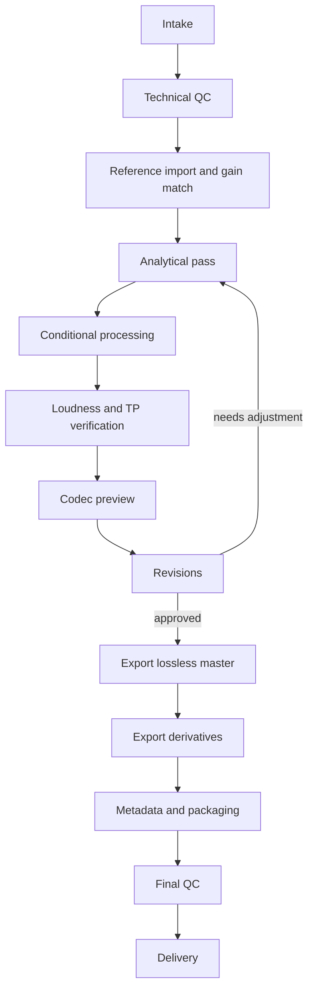

# Modern audio mastering for mastered deliverables

## Executive summary

For a modern mastering application, the most reliable technical foundation is not a single “mastering recipe,” but a stack of measurement and delivery rules: entity["organization","International Telecommunication Union","UN specialized agency"] Recommendation BS.1770-5 for integrated loudness and true-peak estimation; entity["organization","European Broadcasting Union","broadcasting union"] R 128 plus Tech 3341/3342/3343 for loudness workflow, meter behavior, and Loudness Range; and online-audio guidance from the entity["organization","Audio Engineering Society","professional organization"], especially TD1008 and the later AES77 recommended practice listed by AES. Together, these documents move mastering away from sample-peak thinking and toward gated loudness, true-peak protection, and distribution-aware normalization. citeturn30view0turn30view1turn30view2turn46view0turn30view3turn30view4turn21search0

For a one-click or mostly-automatic app, the safest universal policy is: ingest the highest-native lossless source available; process internally in floating point; keep sample rate native unless a deliverable explicitly requires conversion; use a true-peak-aware final limiter with oversampling; default to a streaming-safe ceiling around -1 dBTP; dither only when reducing word length; and export one primary lossless master plus derived deliverables instead of trying to create a separate sonic master for every platform. That policy aligns with official platform guidance that distributors should ingest native high-resolution masters and perform their own encoding, while playback systems or platforms perform normalization downstream. citeturn32view6turn37view5turn37view2turn37view4turn30view4turn7search0turn7search5turn42view0

The strongest modern conclusion is that target-chasing is secondary to sound quality and codec safety. One major service normalizes to -14 LUFS at playback, yet mastering engineers such as entity["people","Dave Kutch","mastering engineer"] explicitly argue that they do not master *to* a service target; they master for the record, then verify loudness and true peak afterward. In practice, that means your app should separate **analysis targets** from **creative targets**: measure everything, but intervene only enough to achieve translation, technical compliance, and codec-safe output. citeturn37view1turn47view2turn24search9turn24search4

A useful adaptive bias for contemporary streaming music is: transparent/default mode for most material; a denser “loud contemporary” mode for pop, rock, metal, and EDM; and a more dynamic mode for acoustic, jazz, classical, filmic, and ambient material. Dense modern metal and djent can usually tolerate more peak shaving than sparse acoustic music, but they are also more vulnerable to cymbal hash, upper-mid harshness, low-end masking, and codec overs when pushed too hard. The app therefore needs not just louder limiting modes, but also stricter harshness detection, low-end mono discipline, and codec preview/QC. citeturn36search0turn8search19turn30view4turn42view0

## Canonical source base

The table below is the shortest credible “must-read / must-implement” source map for a mastering program. It is not exhaustive, but it covers the standards backbone, the most relevant books, a handful of seminal papers, and the most useful official manuals for a modern stereo mastering workflow.

| Category | Source | Publication date | Why it matters | Evidence |
|---|---|---:|---|---|
| Core loudness standard | urlITU-R BS.1770-5turn0search1 | Nov 2023 | Defines programme loudness and true-peak algorithms | citeturn30view0turn31view7turn31view8 |
| Broadcast loudness recommendation | urlEBU R 128turn1search0 | Nov 2023 | Sets -23 LUFS target and use of maximum true peak for signal-chain compliance | citeturn30view1 |
| Meter specification | urlEBU Tech 3341turn1search1 | Nov 2023 | Defines momentary, short-term, integrated, gating, and meter scales | citeturn30view2 |
| Loudness Range | urlEBU Tech 3342turn2search2 | Nov 2023 | Defines LRA as a robust supplementary descriptor distinct from crest factor | citeturn46view0 |
| Production guidance | urlEBU Tech 3343turn2search0 | Nov 2023 | Explains loudness normalization philosophy and production workflow | citeturn30view3 |
| Online audio guidance | urlAES TD1008.1.21-9turn19search5 | Sep 2021 | Internet streaming/on-demand loudness, peak control, codec overshoot | citeturn30view4turn31view5turn31view6 |
| AES recommended practice listing | urlAES77-2023 listingturn21search0 | Jul 2023 | Shows TD1008 evolved into an AES recommended practice for online audio streaming | citeturn21search0 |
| Streaming supplement | urlEBU R 128 s2turn1search9 | Nov 2023 | Streaming guidance, including unchanged -23 LUFS streams or interim -20 to -16 LUFS distribution paths | citeturn38view0 |
| Platform delivery brief | urlApple Digital Masters technology briefturn28search1 | current brief, accessed 2026 | Highest-native master, AAC auditioning, SRC guidance, no upsampling, codec-aware mastering | citeturn32view6turn31view3 |
| Platform asset spec | urlApple Video and Audio Asset Guideturn28search3 | current guide, accessed 2026 | Approved sample rates, 24-bit requirement for Apple Digital Masters, Hi-Res Lossless requirements | citeturn37view5 |
| Streaming ingest docs | urlSpotify loudness normalization docsturn5search0 and urlSpotify file-format docsturn3search0 | current docs, accessed 2026 | Playback normalization at -14 LUFS, delivery bit-depth/sample-rate guidance, lossless ingest | citeturn37view1turn37view2turn37view4 |
| File/metadata standard | urlIFPI ISRC Handbook 4th Editionturn23search0 | 2021 | Correct ISRC assignment principles | citeturn30view6turn31view9 |
| WAV/BWF metadata standard | urlEBU Tech 3285 BWFturn23search2 | v2, 2011 reissue of earlier spec | Broadcast Wave structure and metadata extension chunk | citeturn31view10turn33view0 |
| Textbook | urlMastering Audio: The Art and the Scienceturn16search0 by entity["people","Bob Katz","mastering engineer and author"] | 3rd ed., 2015 copyright / 2014 release page | Still the most complete workflow-oriented mastering text | citeturn16search0 |
| Textbook | urlAudio Mastering: Essential Practicesturn16search1 by entity["people","Jonathan Wyner","mastering engineer and educator"] | 2012; 2nd ed. referenced by Berklee in 2025 | Strong on modern practical workflow and education | citeturn16search1turn16search4turn16search6 |
| Textbook | urlThe Mastering Engineer’s Handbookturn17search0 by entity["people","Bobby Owsinski","author and engineer"] | 5th ed., current sales page | Concise applied overview with modern deliverable context | citeturn17search0 |
| Seminal dither paper | urlQuantization and Dither: A Theoretical Surveyturn19search0 | 1992 | Canonical theory source for why dither is necessary | citeturn19search0turn19search22 |
| Seminal overload paper | urlOverload in Signal Conversionturn22search0 | 2003 | Classic treatment of inter-sample peaks and codec/SRC overload | citeturn44view0 |
| Seminal loudness paper | urlLevel Control in Digital Masteringturn22search1 | 1999 | Early critique of sample-peak-only thinking in mastering | citeturn44view1 |
| SRC research | urlGiant FFTs for Sample-Rate Conversionturn43view0 | Mar 2023 | Relevant modern JAES paper for high-quality offline SRC design | citeturn43view0 |

Official manuals that are especially useful for implementation benchmarking are urlFabFilter Pro-L 2 helpturn7search9 and its workflow/true-peak pages, urlFabFilter Pro-Q helpturn27search2, urlFabFilter Pro-C helpturn27search3, urlSoftube Weiss DS1-MK3 manualturn7search1, urlSoftube Weiss DS5 Multiband Compressor manualturn26search0, urlNUGEN Audio ISL manualturn7search2, urliZotope dithering guideturn8search0 plus the urliZotope Ozone dithering support noteturn9search1, and urlSteinberg WaveLab helpturn10search3 for DDP, metadata, loudness analysis, and final render workflows. citeturn7search0turn7search3turn7search5turn27search2turn35view1turn7search1turn26search0turn42view0turn35view0turn9search1turn10search3turn11search2turn11search4

Modern interviews worth taking seriously because they are consistent with the standards stack are entity["people","Pete Lyman","mastering engineer"] on minimal processing and deliverables, entity["people","Dave Kutch","mastering engineer"] on not mastering to targets, and entity["people","Bob Ludwig","mastering engineer"] on the irreversibility of prior damage and the usefulness of Apple’s codec-check tools. citeturn47view1turn47view0turn47view2turn47view4

## Modern mastering signal chain

A robust mastering chain is best understood as a **conditional** chain, not a fixed franchise order. The modern consensus is that every stage should be bypassable, with the least amount of processing needed to reach translation, cohesion, and technical compliance. That view is explicit in both mastering literature and interviews from experienced engineers. citeturn16search0turn16search1turn47view1turn24search4

```mermaid
flowchart LR
    A[Ingest and QC] --> B[Gain trim and references]
    B --> C{Corrective needs?}
    C -->|Yes| D[Corrective EQ or dynamic EQ]
    C -->|No| E[Broad tonal shaping]
    D --> E
    E --> F{Macro dynamics unstable?}
    F -->|Yes| G[Broadband compression]
    F -->|No| H[Optional spectral control]
    G --> H
    H --> I{Band-local instability?}
    I -->|Yes| J[Multiband or dynamic EQ]
    I -->|No| K[Optional saturation or clipping]
    J --> K
    K --> L[Mid-side or width refinement]
    L --> M[Final true-peak limiting]
    M --> N{Bit-depth reduction?}
    N -->|Yes| O[Dither last]
    N -->|No| P[Export]
    O --> P
    P --> Q[Codec preview and final QC]
```

In a mastering app, the psychologically correct order is usually: **problem solving first, taste second, loudness last**. Corrective EQ, de-essing, resonance suppression, and low-end cleanup should happen before loudness maximization, because once a limiter is working hard, any unresolved harshness or mud tends to get amplified perceptually. Hybrid engineers often make coarse analog moves, then fine digital moves, then render deliverables and metadata in the DAW/editor stage. citeturn47view5turn24search9turn27search2turn26search9turn36search11

### Recommended processing order and conservative implementation envelopes

The table below is **not a standard**. It is a conservative synthesis for an automatic system from the standards above, the core textbooks, and mastering-oriented manuals/interviews.

| Stage | Conservative default envelope for a one-click app | Rationale | Primary support |
|---|---|---|---|
| Input conditioning | Analyze native SR/bit depth; convert internally to 32-bit or 64-bit float; trim to comfortable headroom before processing | Preserves resolution and avoids premature clipping; platforms prefer highest-native delivery | citeturn32view6turn37view2turn37view5turn16search0 |
| Corrective EQ | Prefer broad bells/shelves within about ±0.5 to ±2 dB; reserve larger cuts for obvious faults; HPF only when needed, often in the 20–35 Hz region for cleanup rather than tone | Mastering EQ is “minutiae,” and large moves often indicate mix problems better solved upstream | citeturn24search4turn47view1turn16search1 |
| Broadband compression | Ratio roughly 1.1:1 to 2:1; attack commonly 10–80 ms; release commonly 50–300 ms or auto; aim for ~0.5–2 dB gain reduction in transparent mode | Glue and macrodynamics, without flattening transients; mastering compressor designs emphasize transparency and program dependency | citeturn36search4turn35view1turn16search0turn16search1 |
| Dynamic EQ / de-ess | Event-driven reduction often around 0.5–3 dB; target only problem regions when triggered | Better than static EQ when harshness, sibilance, or low-mid bloom is intermittent | citeturn27search2turn26search9turn36search11 |
| Multiband compression | Use only when a band is unstable; keep ratios low, often around 1.2:1 to 2.5:1; keep per-band GR modest, usually ~0.5–2 dB | Powerful but easy to overdo; best reserved for specific band instability rather than “always on” mastering | citeturn26search0turn27search1turn16search0 |
| Saturation / clipping | Off by default in universal mode; if used, keep peak shaving modest and re-check true peak and codec preview immediately | Can increase loudness efficiency in dense genres, but raises risk of aliasing, harshness, and codec overs | citeturn7search5turn36search0turn30view4 |
| Width / M-S refinement | Keep low bass effectively mono or width-constrained below roughly 80–150 Hz; prefer tiny side-only EQ shelves or mid-only control over aggressive widening | M/S processing is useful in mastering, but low-frequency width and exaggerated side energy reduce translation | citeturn34view2turn27search24turn12search17 |
| Final limiter | Enable oversampling and true-peak limiting; in streaming-safe mode default ceiling ≈ -1 dBTP; if single-stage limiting must exceed ~2–4 dB often, consider a staged strategy or back off | Prevents downstream codec/SRC overshoot and keeps the limiter from becoming the sound of the record | citeturn7search0turn7search3turn7search5turn42view0turn31view5turn47view2 |
| Dither | One pass only, last in chain, only when reducing bit depth; if available use MBIT+ or equivalent; otherwise TPDF/Type 2 is a solid fallback | Dither is required for requantization; post-dither processing undermines it; stronger shaping can raise peaks | citeturn9search1turn34view1turn35view0 |

### Practical guidance for each stage

**EQ.** A mastering app should default to broad, low-Q moves and only allow surgical notches when analysis clearly identifies a stable, narrow problem. entity["people","Bob Ludwig","mastering engineer"] has described mastering as “totally dealing with minutiae,” and noted that a 3 dB master EQ move is already a lot. entity["people","Pete Lyman","mastering engineer"] similarly argues for the least processing necessary. For an automatic system, that strongly favors conservative, wide-band moves, with dynamic EQ preferred over static EQ when the issue is transient or program-dependent. citeturn24search4turn47view1turn27search2turn26search9

**Compression.** Automatic mastering compression should be transparent by default. Mastering-oriented compressor algorithms are explicitly designed for low harmonic distortion and fast transient catching, but the manuals also emphasize program dependency and the danger of too-fast time constants dulling the source. A safe implementation is therefore a low-ratio, soft-knee, auto-or-tempo-insensitive release design, with hard caps on gain reduction before the algorithm steps down or bypasses itself. citeturn36search4turn35view1turn16search1

**Multiband and dynamic spectral control.** These tools should be treated as “secondary correctives,” not as permanent tone generators. The official descriptions of dynamic EQ and resonance suppressors make their purpose very clear: intervene only when and where the problem occurs. For modern one-click mastering, that makes adaptive spectral control more defensible than static multiband compression, especially on mixes with occasional cymbal glare, vocal sting, or palm-muted low-mid buildup. citeturn27search2turn26search9turn26search2

**Stereo imaging.** Real mastering practice uses M/S as a surgical tool, not a party trick. The clearest app-default behavior is: keep bass centered, allow small side enhancement above the low end, and prefer M/S EQ or selective dynamics over blind widener algorithms. The manual examples from mastering-oriented processors explicitly frame mid-only or side-only processing as a transparency aid, especially when center content carries bass, kick, snare, or lead vocal. citeturn34view2turn27search24turn12search17

**Limiting.** Limiting is not just about “ceiling” anymore; it is about what survives codec encoding, SRC, and playback normalization. Mastering limiter manuals now explicitly discuss true peak, oversampling, lookahead, and codec safety. The most important design choice for your app is to make the limiter **distribution aware**: a streaming-safe mode should prioritize true-peak protection and codec preview, while a CD-only or in-house-reference mode can permit slightly tighter sample-peak ceilings if no lossy encode is expected. citeturn7search0turn7search11turn7search5turn42view0turn31view5

## Loudness, metering, codecs, and adaptive targets

Modern loudness metering is anchored in BS.1770’s gated, K-weighted measurement family. Integrated loudness is computed over 400 ms blocks with 75% overlap and gating; EBU “Mode” then layers on momentary loudness over 0.4 s, short-term loudness over 3 s, integrated loudness, LRA, and maximum true peak. LRA is intentionally distinct from crest factor or “dynamic range”; it describes variation over a larger time scale and is computed from a gated distribution rather than single fast peaks. citeturn31view8turn30view2turn46view0

### Metering primitives your app should expose internally

| Metric | What it tells the app | Core meaning in standards/docs | Evidence |
|---|---|---|---|
| Integrated loudness | Global playback-normalization relevance | Average gated programme loudness | citeturn30view0turn30view2 |
| Momentary loudness | Fast overload perception; transient density | 0.4 s loudness window | citeturn30view2 |
| Short-term loudness | Musical phrase-level density | 3 s loudness window | citeturn30view2 |
| Maximum true peak | Downstream clipping risk after DAC/SRC/codec | Peak estimate between samples | citeturn31view7turn42view0 |
| Loudness Range | Macro-dynamic spread | 10th–95th percentile spread after cascaded gating | citeturn46view0 |
| PLR | Practical master density vs. headroom | Difference between programme loudness and max true peak | citeturn38view0turn30view4 |

### Recommended targets and how to use them

There is no single official LUFS target for commercial music mastering across all streaming platforms. The standards world gives you loudness *measurement* and normalization frameworks; platforms give you ingest and playback behavior; engineers then fill the gap artistically. That is exactly why a modern mastering app should have **technical constraints** and **style ranges**, not one universal loudness commandment. citeturn30view0turn21search0turn37view1turn47view2

| Context | Practical target / rule | Use in an app | Evidence |
|---|---|---|---|
| EBU broadcast / TV | -23 LUFS programme loudness, max true peak usually checked against -1 dBTP chain limit | Broadcast mode / QC mode | citeturn30view1turn30view3 |
| EBU streaming supplement | Stream unchanged at -23 LUFS when metadata/device gain is available; interim broadcaster-controlled distribution may sit around -20 to -16 LUFS | Separate “broadcast streaming” mode, not general music mode | citeturn38view0 |
| AES online audio-only guidance | Example format recommendations: pop music -16 LUFS, mixed format -17 LUFS, news/talk -18 LUFS | Useful for radio/podcast style outputs more than album mastering | citeturn31view4 |
| Major music-stream playback normalization | One major service adjusts playback to -14 LUFS by default | Do **not** force all masters to -14; instead verify normalization consequences | citeturn37view1 |
| Streaming-safe release master | Usually somewhere in a genre-dependent band, often roughly -14 to -10 LUFS if it still sounds good; denser contemporary genres may sit lower, more dynamic genres higher | Best default “music release” mode | citeturn8search19turn47view2turn37view1 |
| True peak for lossy/streaming derivatives | Prefer about -1 dBTP as a default safe ceiling; stricter margins may be prudent for difficult material | Your default limiter ceiling | citeturn7search3turn42view0turn31view5turn37view1 |

The most important policy decision is that your app should **not** equate “streaming” with “-14 LUFS.” One major service normalizes there at playback, but that does not mean the master should be created there. entity["people","Dave Kutch","mastering engineer"]’s stance is the best shorthand: loudness targets are not the first thing he thinks about; sound is. In a mastering app, that translates to this logic: first optimize clarity, density, and distortion behavior; second ensure true-peak safety; third report what normalization will do on playback. citeturn47view2turn37view1

### Genre adaptation with a small djent/metal lean

For dense pop/rock/metal material, a mastering app can safely allow more peak shaving and a slightly louder integrated result than it would for jazz, acoustic, classical, or cinematic material. Even the urlFabFilter Pro-L 2 advanced settings pageturn36search0 explicitly describes its Aggressive style as working especially well on rock, metal, or pop, while the same documentation frames Modern as the transparent all-purpose default. More generally, modern educational references place dense genres in a rough range around the low teens to high single digits LUFS, while more dynamic genres often sit materially quieter. citeturn36search0turn8search19

For djent/metal specifically, the app should bias toward: preserving kick/snare transient definition with slower compressor attack than the mix would use; monitoring low-mid accumulation from guitars and bass around the punch/wool region; controlling intermittent upper-mid and treble harshness dynamically rather than with large static cuts; and being extra strict with codec preview because cymbals, clipped guitars, and dense limiter activity can create audible AAC/MP3 edge. Those are best implemented as small, adaptive corrections rather than large static “metal EQ curves.” citeturn27search2turn26search9turn30view4turn42view0

## File-format conversion, dithering, and source-dependent workflows

The high-confidence workflow for sample rates and bit depths is straightforward: **master at native resolution, export at native resolution unless a deliverable requires otherwise, and avoid unnecessary SRC**. urlApple Digital Masters technology briefturn28search1 asks for the highest native sample rate available; urlSpotify’s file-format guidanceturn3search0 likewise says not to downsample tracks mastered above 44.1 kHz before delivery. If a separate deliverable does require SRC, do it once, with a high-quality offline SRC, and only then make the bit-depth reduction decision. citeturn32view6turn37view2turn43view0turn9search1

### Sample-rate and bit-depth guidance

| Scenario | Preferred mastering/output path | Evidence |
|---|---|---|
| Native 24-bit WAV/AIFF/FLAC at 44.1–192 kHz | Keep native SR through mastering; export one native lossless master for distribution | citeturn37view2turn37view4turn37view5turn32view6 |
| Native 16-bit source only | Process internally in float; if final deliverable remains 16-bit, dither on final export; do not “bit-pad” fake 24-bit source claims | citeturn31view3turn9search1turn35view0 |
| CD / DDP deliverable | Convert to 44.1 kHz if needed using high-quality SRC, then dither once to 16-bit | citeturn9search1turn10search3 |
| Apple Digital Masters | Deliver 24-bit approved format at 44.1/48/88.2/96/176.4/192 kHz, highest native available; no upsampling | citeturn37view5turn32view6 |
| Hi-Res Lossless | 24-bit at 88.2/96/176.4/192 kHz | citeturn37view5 |

Dithering is not optional when you actually reduce word length. The official and semi-official guidance here is unusually convergent: do all processing first, do sample-rate conversion before dithering when SRC is required, then apply dither exactly once as the absolute last processing stage before writing the lower-bit file. urliZotope’s Ozone dithering support noteturn9search1 says this plainly, and the older but still useful urliZotope dithering guideturn8search0 recommends MBIT+ when available and TPDF/Type 2 as the practical fallback. It also notes that more aggressive noise shaping can raise peaks, which is why true-peak checking after the final export remains important. citeturn9search1turn34view1turn35view0

### WAV versus MP3 source workflows

A mastering app should treat **lossless** and **lossy** intake very differently.

| Source type | Recommended workflow | Why |
|---|---|---|
| WAV / AIFF / FLAC lossless | Full mastering path at native resolution, then derive secondary outputs from the lossless final | Best source fidelity; aligns with platform ingest guidance | citeturn37view2turn37view4turn37view5 |
| MP3 / AAC intake, original lossless unavailable | Decode once to float for processing; use lighter corrective moves; leave more true-peak headroom; preview the final lossy encode; export a lossless master internally, then encode the consumer lossy file once | Codec artifacts are irreversible; further clipping/SRC/encoding can worsen overshoot and edge artifacts | citeturn32view6turn30view4turn42view0turn47view4 |
| MP3 / AAC intake, original lossless available elsewhere | Request/reuse the lossless original and bypass the lossy source entirely | Prevents lossy-to-lossy degradation and avoids mastering “on top of damage” | citeturn47view4 |

The most application-relevant lesson from platform documents and true-peak papers is that lossy codecs can overshoot beyond the sample peaks of the master, especially on hot material. That is why codec preview, true-peak limiting, and conservative ceilings are much more important for lossy-source workflows than for purely archival PCM mastering. It is also why an app should never silently transcode lossy input multiple times during preview or export. Decode once for analysis/processing; encode once for final consumer distribution. citeturn30view4turn42view0turn44view0

## Deliverables, metadata, QC, and implementation templates

Modern deliverables are split between a **primary archival/distribution master** and **format-specific derivatives**. For streaming, the primary master should usually be one high-quality lossless stereo file at the project’s native mastered bit depth and sample rate. For CD, you likely need a dedicated 44.1/16 DDP image or equivalent CD-conform package. For MP3 consumer files, you need final encoded derivatives with correct metadata, not a separate “mastering chain philosophy.” citeturn37view4turn10search3turn47view0turn47view5

### Delivery specifications

| Deliverable | Recommended file spec | Metadata / package notes | Evidence |
|---|---|---|---|
| Primary streaming/distributor master | Stereo lossless file; preferably 24-bit; native mastered sample rate; FLAC or WAV depending distributor | One master per track is sufficient for modern services; avoid unnecessary downsampling | citeturn37view4turn37view2turn37view5 |
| Apple Digital Masters submission | 24-bit approved format; 44.1/48/88.2/96/176.4/192 kHz; native resolution; AAC audition checked | No upsampling/bit-padding; use Apple encoder preview tools | citeturn37view5turn32view6 |
| CD / DDP | 44.1 kHz / 16-bit PCM | Dither on final reduction; use DDP image or CD-conform package; ISRC/CD-Text/UPC-EAN as required | citeturn10search3turn11search4turn11search13turn9search1 |
| Broadcast WAV archive | WAV with BWF metadata when needed | BWF carries a broadcast-audio extension chunk and is widely used for archival/pro workflows | citeturn31view10turn33view0 |
| MP3 deliverable | Final consumer derivative only, encoded once from final lossless master | Use ID3 metadata; do not treat MP3 as archival master | citeturn23search3turn23search15turn37view4 |
| Mix/master package for label/client | Final master + alt versions as requested, often including mix master, vocal-up, instrumental/no-lead-vocal variants | AES/Recording Academy delivery recommendations are especially useful for naming/versioning logic | citeturn39view0turn40view0turn40view1 |

Metadata handling matters more than many mastering tools admit. According to the relevant docs, WAV can carry RIFF and BWF metadata, and some mastering tools also support ID3 in WAV; MP3 commonly uses ID3 tagging; and ISRC must follow assignment rules that bind one code to one distinct recording/version. An app that writes consumer files should therefore separate **audio rendering** from **metadata writing** and keep a deterministic metadata manifest per export. citeturn11search18turn11search2turn23search3turn23search15turn31view9

### Example mastering-session flow

A mastering session template for software should include, at minimum, slots for references, loudness/TP metering, spectrogram or FFT, vectorscope/phase scope, a conditional corrective stage, a conditional broadband-dynamics stage, a conditional spectral-control stage, a final true-peak limiter, and an export lane with codec preview. entity["people","Pete Lyman","mastering engineer"]’s WaveLab workflow is a good model here: sequence, rough fades/spacing, passive whole-project listen, focused per-track corrections, peak limiting/selective de-essing, render continuous master, then generate required versions and metadata. citeturn47view5turn47view0

### Operational checklists for an app

**Pre-master intake QC**

- Detect file type, sample rate, bit depth, channel count, lossy/lossless status, clipped-sample count, and DC offset.
- Measure integrated loudness, short-term max, momentary max, maximum true peak, LRA, and phase/correlation.
- Flag likely codec-compromised or already-overlimited files before processing. citeturn30view0turn30view2turn46view0turn30view4turn47view4

**Processing QC**

- Gain-match all before/after comparisons.
- Enforce per-stage intervention caps in transparent mode.
- Re-check true peak after any stage that can create overshoot: clipping, limiting, SRC, dithering with shaping, or lossy preview.
- Prefer bypass over stacked correction if no stage materially improves translation. citeturn7search5turn31view5turn9search1turn47view1

**Final export QC**

- Verify final sample rate/bit depth against intended destination.
- Verify no post-dither processing occurred.
- Preview AAC/MP3 derivative for clipping/edge distortion.
- Verify metadata manifest, ISRC mapping, file naming, folder structure, and version consistency.
- For CD/DDP, run conformity checks and ensure timing/PQ/text fields are finalized. citeturn9search1turn32view6turn37view5turn39view0turn40view0turn40view1turn10search3

### Minimal adaptive policy for a one-click mastering app

A practical implementation can be surprisingly disciplined:

1. **Analyze** native file and compute LUFS-I, max short-term, max momentary, max dBTP, LRA, peak histogram, clipped-sample count, low-frequency correlation, and basic spectral balance. citeturn30view0turn30view2turn46view0  
2. **Classify** into broad operating modes such as transparent, standard contemporary, dense/loud, and dynamic/acoustic. Use spectral density and dynamic descriptors, not genre tags alone. citeturn38view0turn47view2  
3. **Apply only necessary stages**, in order: corrective EQ → broad dynamics → adaptive spectral control → final TP limiting → optional dither. citeturn47view1turn27search2turn26search9turn7search3turn9search1  
4. **Codec-preview and export** one primary lossless master, then derived deliverables. citeturn32view6turn37view4turn42view0

## Open questions and limitations

There is still no universal, official, genre-specific loudness target for commercial music platforms in the way broadcast has an explicit -23 LUFS target. Platform normalization behavior is real and documented, but music-mastering loudness remains a hybrid of standards, platform behavior, and engineer judgment. That is why the best modern app design emphasizes sound-first processing, true-peak safety, and playback prediction instead of a single numeric loudness destination. citeturn37view1turn38view0turn47view2

This report is also intentionally centered on **modern stereo/digital mastering**. Vinyl cutting, immersive mastering, and restoration/remastering from damaged legacy media each require their own deeper, format-specific rule sets and human review paths. Where physical media is concerned, CD/DDP is straightforward to automate; vinyl is not. citeturn10search3turn47view0turn29search2