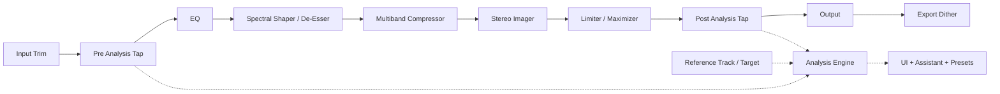
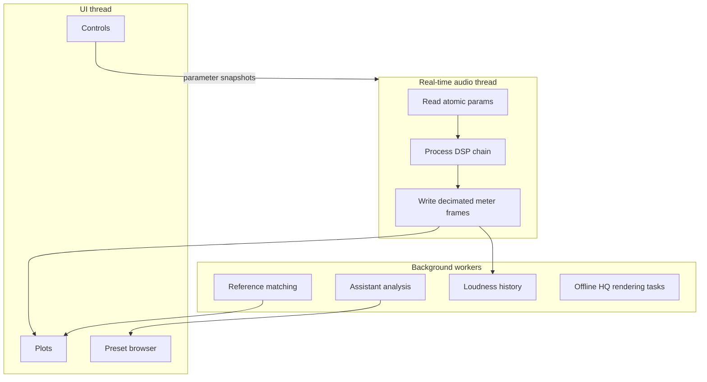

# Most Recent Mastering App Research

**Merged research dossier — 2025/2026.** Combines two independent deep-dives:
1. A market survey of 14+ shipping mastering products (LANDR, Ozone 11/12, eMastered, CloudBounce, BandLab, Bakuage, Masterchannel, RoEx, Matchering, Sonible, Mastering The Mix, TBProAudio/YouLean, ADPTR Metric AB, iZotope Neutron).
2. An engineering blueprint for building a modern mastering plug-in grounded in LANDR + Ozone official documentation, ITU-R BS.1770-5, EBU R 128, AES streaming guidance, and the Audio EQ Cookbook.

Overlapping content (LANDR/Ozone descriptions, signal chain order, LUFS targets, dithering theory) has been deduplicated into single canonical sections.

---

## TL;DR

- The convergent UI pattern across modern mastering products is: (1) a one-button **Assistant/Analyze** pass that listens to ~8 s of the chorus, (2) a small set of macro sliders (**Tone/EQ, Width, Dynamics, Loudness/Intensity, Saturation**), (3) a **genre/style picker** that effectively chooses an internal target curve, (4) **reference-track loading**, (5) **loudness-matched A/B**, and (6) a **LUFS + true-peak readout** with platform presets. Everyone has the basics; almost nobody combines great album mode + DDP + great metering + reference matching in one tool.
- The "AI" in 2025/2026 commercial mastering is overwhelmingly **spectral target-curve matching + dynamics matching + auto-threshold limiting**, plus increasingly **neural stem separation** (Ozone Stem Focus, Master Rebalance, Stem EQ, eMastered Stemify) and **adaptive resonance taming** (Ozone Stabilizer, Soothe-style processors). Reinforcement-learning approaches like Masterchannel's are the outlier.
- LANDR and Ozone solve the same problem with opposite philosophies: LANDR is a **macro-centric AI front-end** that compresses mastering into a few decisions; Ozone is a **modular mastering workbench** with an assistive entry. The strongest product pattern for a new app is **two-tier operation** — a LANDR-style "fast lane" over an Ozone-style "deep lane" where each stage can be bypassed, reordered, inspected with delta monitoring, and switched between low-latency/live and high-quality/render modes.
- The biggest opportunity gaps are: integrated **codec preview** that is actually accurate (Spotify/Apple normalized + AAC/Ogg encoded), real **album mode** with track-to-track consistency analysis and DDP/ISRC export, transparent **why-it-did-that** explainability for AI moves, and a metering panel that combines LUFS history + PSR/DR + tonal-balance target + reference overlay in one always-visible HUD.
- The standards layer should be first-class. BS.1770 underpins loudness and true peak; EBU R 128 anchors broadcast at −23 LUFS / −1 dBTP; AES guidance for internet audio emphasizes true-peak limiting and headroom for lossy codecs. Ship **destination presets** that explicitly encode LUFS/true-peak assumptions instead of leaving users to guess.

---

## 1. Per-product deep-dives

### 1.1 LANDR (web + LANDR Mastering Plugin)

**Style/intent paradigm.** LANDR's "Synapse" / "Tonic" engine standardised the **Style × Intensity** two-axis interface that almost every web-based service later copied:
- **Styles: Warm, Balanced, Open.** Warm = softer compression, fuller low-mids, intimate top. Balanced = controlled, focused mid-range, the "default" pick. Open = mid-scoop, punchy low-end, modern airy top. Lead engineer Al Isler describes Open as "very clear and articulate, but with a solid, punchy low-end... a generally modern sound."
- **Intensity: Lo / Med / Hi** — effectively chooses how aggressively the limiter and multiband compression work. Lo preserves dynamics; Hi essentially eliminates dynamic range. LANDR documentation states the engine uses "micro-genre detection to make subtle frame-by-frame adjustments using tools like multi-band compression, EQ, stereo enhancement, limiting and harmonic saturation."

**Plugin (in-DAW) controls.** Real-time mastering in the DAW marketed as "fast, simple AI mastering." The macro UI exposes five knobs: **EQ** (a tilt-style high/low control), **Compression**, **Saturation**, **Stereo Width / Focus**, **Loudness** — plus Master, Bypass, Gain Match, loudness meter, output meter, presence, and de-esser controls. It also keeps the three Styles and adds a built-in LUFS meter.

**Reference matching.** Up to **3 reference tracks** can be uploaded; the engine performs spectral/dynamic matching against them in addition to or instead of a Style choice.

**Album mastering.** LANDR offers true batch/album mastering — "the engine analyzes the full tracklist to create consistent, balanced masters across every song" — including a Volume Matching toggle for comparing different settings across tracks. This is one of LANDR's main differentiators vs eMastered.

**A/B & preview.** Web UI offers an A/B toggle between the unprocessed file and each style+intensity pair, with no gain matching by default (commonly criticised in reviews). The plugin does support Gain Match as a first-class control.

**Formats.** Plugin: macOS VST3/AU/AAX, Windows VST3/AAX. Online outputs: 320 kbps MP3, 16-bit WAV at 44.1 kHz, or 24-bit HD WAV preserving original sample rate.

**Latency/CPU controls.** LANDR's public UX emphasizes "real-time processing" and workflow speed but does not expose algorithm-quality modes.

**What LANDR is inferred to be doing under the hood.** Spectral analysis → genre detection → matching to internal genre profile → multiband compression → EQ adjustments → stereo enhancement → harmonic saturation → limiter set to hit Spotify-style targets. LANDR has not published technical papers, but their marketing repeatedly emphasises "machine learning" with a large training corpus of mastered tracks per genre. Support docs say the engine uses machine learning to determine what processors to use or bypass and how they react dynamically. LANDR's internal DSP (exact module topology, limiter design, crossover strategy, oversampling policy) is opaque relative to Ozone's documentation.

### 1.2 iZotope Ozone 11 / Ozone 12

Ozone is the dominant commercial mastering suite and remains the de-facto reference for what "complete" mastering software looks like. Ozone 11 was current at the time of the user's UI screenshots; **Ozone 12 was released September 3, 2025** (per the iZotope/Native Instruments press release out of Boston), adding Stem EQ, Bass Control, Unlimiter and IRC 5.

**Module list (Ozone 11 Advanced — 17 modules):** Equalizer, Dynamic EQ, Stabilizer, Match EQ, Spectral Shaper, Imager, Maximizer, Dynamics, Exciter, Low End Focus, Master Rebalance, Impact, Vintage EQ, Vintage Compressor, Vintage Tape, Vintage Limiter, plus Clarity (Advanced only). Each module can be loaded as a stand-alone plugin or chained inside the "mothership" Ozone plug-in.

**Ozone 12 adds:** Stem EQ, Bass Control, Unlimiter (ML-based "undo" for over-compression), Magnify, plus a redesigned Master Assistant with a "Custom" flow and IRC 5 limiting.

**Master Assistant workflow.** Insert on master → click Master Assistant → play loudest ~8 seconds → Ozone builds a chain. Master Assistant exposes target sub-categories: **Tonal Balance, Vocal Balance, Stereo Width, Dynamics, Loudness.** A target can be a genre profile (dozens available, expanded in Ozone 12) **or** a user-uploaded reference. Resulting macro controls: Tonal Balance knob, Loudness slider, Dynamic Match, Width Match, Clarity Amount, Stabilizer Amount, plus an Equalizer scale 0–200% (linked to EQ1's global gain).

**Earlier Master Assistant intent options (Ozone 8/9, still useful template):** Target = **Streaming / CD / Reference**; Loudness = **Low / Medium / High** mapped to specific LUFS values (e.g. **HIGH = −11 LUFS**); Destination sets the Ceiling (Streaming = −1.0 dB, CD = −0.3 dB). Mode = **Modern / Vintage** chose between non-vintage vs vintage module chains. Ozone's assistant uses integrated LUFS, sets Full Scale to −0.1 dB output with true-peak off, and Streaming to −1 dB output with true-peak on.

**Tonal Balance Control 3.** A companion plug-in/standalone that shows your spectrum against genre target curves (over 30 genre/subgenre curves in TBC3 — "from classic hip hop to punk rock to K-pop"). New features: **Target Blender** (weighted blend of two targets), **Vocal Balance / Dynamics / Stereo Width meters**, **built-in Hybrid EQ** (static + dynamic nodes). Curves are derived from analysis of large numbers of commercial recordings per genre and shown as blue tonal "tunnels" with the user's track as a white line.

**Maximizer & IRC modes.**
- **IRC LL** — lowest latency, lowest CPU, IRC I quality.
- **IRC I** — psychoacoustic limiting, quick on transients, slow on bass.
- **IRC II** — like I but preserves transients more aggressively.
- **IRC III** — "most aggressive" psychoacoustic model; high CPU and latency; sometimes unusable in real time at >48 kHz.
- **IRC IV** — multiband psychoacoustic limiter using "dozens of psychoacoustically spaced bands"; four character "styles": **Classic / Modern / Transient / Balanced**. IRC IV is the most popular professional mode.
- **IRC 5 (Ozone 12)** — the newest algorithm, marketed as enabling "outstanding loudness and stunning clarity… No pumping. No distortion."
- Maximizer adds **Learn Threshold** that targets a Target LUFS value, **Stereo Independence (Transient/Sustain) sliders**, true-peak detection, soft clipping, and a scrolling waveform + gain-reduction trace mini-meter.

**Stabilizer.** Adaptive (Soothe-/Gullfoss-style) EQ. Modes: **Shape** (bring track toward target curve) and **Cut** (resonance suppression). Controls: Target (genre curve, 25+ in Ozone 12), Amount (max boost ≤ 9 dB at 100%), Speed, Smoothing, Sensitivity. M/S and Transient/Sustain processing modes supported.

**Reference / Track Referencing.** In Ozone 10+ the Master Assistant can match to a user reference; the **Track Referencing panel** loads up to **10 reference tracks** alongside the master (some sources cite 4; current docs show up to 10), with **automatic loudness match**, looping, and "Jump to loudest section" detection. iZotope **Audiolens** (separate utility) captures characteristics from any audio playing on the desktop (Spotify, YouTube) and feeds them into Ozone/Neutron as targets.

**Codec Preview.** Inside Ozone's mothership the Codec Preview lets you audition your master as **MP3 or AAC** at various bitrates. iZotope RX's Streaming Preview goes further: presets for Spotify, Apple, Amazon, Tidal, YouTube with both codec and loudness normalization preview.

**Imager.** Band-split stereo width acting on side-channel gain. Stereoize is available only when widening; Recover Sides is available only when narrowing. Stereoize Mode I is Haas-effect–based decorrelation, injecting a delayed mid copy into the side channel. Exposes correlation/vectorscope tools, width spectrum, and stereo balance meter throughout to protect mono compatibility. Ozone's assistant explicitly avoids widening a sufficiently narrow low band during processing — a subtle but excellent user-protection rule.

**Other notable modules.**
- **Match EQ** — captures a reference spectrum and applies it as a target curve with a fineness control.
- **Master Rebalance** — neural stem separation that lets you raise/lower vocals, bass, drums, or other on a finished stereo mix in real time.
- **Stem Focus (Advanced)** — applies any Ozone module to one isolated stem.
- **Impact** — 4-band micro-dynamics enhancer (punch / glue per band).
- **Clarity** — adaptive spectral-power maximization with slope control; advertised as "louder without penalties."
- **Low End Focus** — drive/punch/balance below ~200 Hz, regardless of room.
- **Spectral Shaper** — dynamic harshness control (de-essing for the master bus). Exposes intensity mode, amount, tone tilt, attack/release, learnable action region, and a difference meter.
- **Vintage EQ** — Pultec-style 6-band with push-pull bands.
- **Vintage Compressor** — 1176-ish character (not a direct clone).
- **Vintage Tape** — tape saturation/compression.
- **Vintage Limiter** — coloured limiter modelled after older single-band hardware limiters.

**UI patterns worth copying.** Each module has a **delta button** (listen to what the module is removing/adding), a **bypass + power**, a **gain-match toggle** so bypass A/B is loudness-fair, and **history sidebar** (8 most recent settings) with undo. The mothership shows a horizontal chain of module tiles you can drag-reorder. There's a global **Settings → I/O / dither / oversampling / metering scale** menu. Reference tracks live in a panel that overlays the main view rather than being a separate window. Ozone also exposes: per-module solo, signal-chain reordering, difference meters, and an I/O panel — clear evidence that serious users want local inspection without leaving the main window.

**I/O, dither, oversampling.** Ozone offers MBIT+ dither with shaping levels **Off / Low / Medium / Strong / Max**; Auto-blanking; Harmonic Suppression; Limit Peaks; per-instance oversampling on Maximizer and other non-linear modules. Bit depth, dither amount, peak limiting, noise shaping, and silence blanking are all treated as **export concerns** — a good product decision: dithering is explicit and delivery-focused, not buried.

**Performance & latency guidance (from official docs).** Remove unused modules; increase host buffer if possible; reduce enabled bands; prefer Stereo over Mid/Side or Transient/Sustain when possible; tune EQ/crossover buffers. IRC 3/4 can be too latent for real time at high sample rates. True-peak limiting raises CPU. Ozone is explicit that **its Learn Input Gain is not recommended for loudness compliance** — compliance requires a full loudness-measurement workflow, not just a gain guess.

**Formats.** Current release notes list AU/AAX/VST3, all 64-bit. Reference files support WAV, AIFF, MP3, AAC, FLAC. Dither target depths: 24/20/16/12/8 bit.

**EQ phase modes.** Ozone frames the split as **Analog = minimum-phase IIR** and **Digital = linear-phase FIR**, with Digital costing more CPU. Phase control hints at allowing a spectrum between linear and minimum phase in advanced processing.

### 1.3 eMastered

- **Pedigree.** Co-founded by Grammy-winning mixing and mastering engineer **Smith Carlson** (known for his work on Taylor Swift's *1989*) and electronic music artist **Collin McLoughlin** — per eMastered's own blog, "our algorithm was created by Smith Carlson, a Grammy-award-winning mixing and mastering engineer known for his work on Taylor Swift's *1989*, and electronic music artist Collin McLoughlin."
- Workflow: drag file → AI pass → preview vs original → adjust five **post-process sliders**: Compression intensity, EQ balance, Stereo Width, Volume, **Mastering Strength** (overall mix-in/out of the AI processing).
- **Reference matching** is supported — upload a track and the engine matches loudness, balance, and compression character.
- **No batch/album mode** as polished as LANDR's.
- Files supported: MP3/WAV/AIFF in; user reviewers note exports of WAV/MP3 only.
- Common pain point: "the sliders work more like preset switches than true continuous controls" — the engine partially re-renders on the server when you change them.
- UI is one of the cleanest of the web services, with a big A/B toggle, waveform, and a "Stemify" stem-separation companion tool.

### 1.4 CloudBounce (now owned by Image-Line / FL Studio)

- 15+ **genre-specific presets** (Default, Rock/Pop, Jazz/Blues, World, Electronic, etc.); the web "fine-tune" choices are binary: **Louder, Quieter, Warmer, More Bass**, plus a feedback channel (which doesn't actually feed back into the master, per Sound on Sound).
- The desktop app adds: **reference matching** (user references or library), **loudness dial in LUFS**, **stereo widener, multiband compression, exciter, high-pass filter** as togglable modules, plus per-module sliders (e.g. amount of bass, brightness, warmth in the Rock preset).
- **Album mastering** is supported in the desktop app — multiple files, album-wide settings, track order.
- Outputs: WAV 16/24-bit, MP3 320 kbps, plus OGG/FLAC/AIFF on Infinity plans.
- Drag-and-drop, looping player, instant previews are core UX; the company tells reviewers their algorithm "is able to detect if the audio track is already mixed or mastered with very little or no headroom, and makes decisions based on the general signal level, peaks and audio waveform."

### 1.5 BandLab Mastering (free, web + mobile)

- Free **4 presets**: **Universal** (organic dynamic processing & tonal enhancement), **Fire** (punchy lows without muted vocals), **Clarity** (breathy highs with light dynamic expansion), **Tape** (warm tape saturation with analog dynamic processing).
- Members get **4 extra presets**: **Natural** (preserves acoustic tone), **Cinematic** (punchy low-end, preserved dynamics for orchestral/film), **Spatial**, **Punch** (impact/definition for hip-hop/rap).
- **Intensity slider** (Members only): 11 levels from Light → Heavy. This is essentially the model the user's app is mirroring with its Universal/Clarity/Tape/Spatial/Oomph/Warmth/Punch/Loud/Energy presets + intensity slider.
- **Album Mastering**: when multiple files are imported, BandLab's Album Mastering view lets you preview the tracks together, apply the same preset to all, or compare presets per track.
- Presets were co-designed with named engineers — per BandLab's own blog, "Mandy Parnell is a Grammy-nominated audio mastering engineer and founder of Black Saloon Studios in London. She has mastered for the likes of Aphex Twin, The XX, Björk, Brian Eno and many more"; the others credited are Mike Tucci (Living Colour, Chris Brown), Maria Elisa Ayerbe (Mary J Blige, J Lo), Justus West and Will Quinnell.
- BandLab Mastering uses BandLab's own algorithmic engine (not LANDR), and runs ~10× faster than rival web services per most reviews.

### 1.6 Bakuage / aimastering.com (Japan)

- Founded by **Bakuage Co., Ltd.**; their flagship has been offered free since ~2021.
- Key features: **target loudness in LUFS** specified by the user (can push very high, advertised as "extremely loud and transparent"); reference-track support including a **YouTube URL** as reference; offline desktop version (Windows/Mac/Linux) on GitHub.
- The mastering algorithm is **open source**: `phaselimiter` and `aimastering-tools` on GitHub. The phaselimiter is, technically, a multiband limiter that also reshapes phase to maximise loudness without distortion.
- The Bakuage team published the most rigorous public analysis of YouTube's loudness normalization, deriving that YouTube uses a ~3 s short-term loudness, 96.7% overlap, max-aggregation model with a target of about **−10.3 LUFS** (so quieter masters are not boosted up).
- UI: full-track preview, mastering-style presets, reference track support, monthly subscription tools (now free), simple dashboard at app.bakuage.com.

### 1.7 Masterchannel

- Norwegian AI mastering service. **Co-founded by superstar DJ Tom "Matoma" Stræte Lagergren, German mastering engineer and audio researcher Simon Hestermann (CTO, formerly Fraunhofer IDMT), and Norwegian serial entrepreneur Christian Ringstad Schultz (CEO)** — per the official press release.
- Schultz publicly emphasises a **reinforcement-learning** approach rather than dataset mimicry: rather than training on a large song corpus, Masterchannel trained the engine against "benchmark results" produced by thousands of human engineers, so the AI optimises for an objective standard.
- Mastering engine has been updated 100+ times; current rounds claim ~2 minutes per song. Free tier exists; paid tiers (~$15–20/month) unlock unlimited downloads up to 192 kHz / 64-bit.
- UI is the simplest of all major services: drag, drop, download. No style picker, no intensity slider — claims to detect genre influences and "fix only what's necessary."
- Genre-agnostic; offers a "Wez Clarke AI" tier in addition to its main engine.

### 1.8 RoEx / AI Mastering / Cryo Mix / Aria

- **RoEx Automix** — full multi-track mixing and mastering, up to 16 stems; positioned more as a mix tool that masters on the way out.
- **Cryo Mix** — multi-track up to 32 stems, originally hip-hop focused, by Craig McAllister. Includes a beat optimiser and AI stem separator.
- **MajorDecibel** and **Aria** — niche / boutique services; Aria notably uses a real analog mastering chain controlled by a robotic arm ($19 single, $49/mo subscription).
- All converge on the same UI primitives: drag, preset, intensity, preview, pay-to-download.

### 1.9 Matchering (open source)

- Python library + Docker image + ComfyUI node (sergree/matchering on GitHub, GPL).
- Algorithm: take a TARGET (your mix) and a REFERENCE (your favourite finished song); match the target's **RMS, frequency response (FR), peak amplitude, and stereo width** to the reference. Outputs 16-bit and/or 24-bit mastered WAVs.
- Pure FFT-based spectral matching + RMS matching + level matching + simple soft-clip/limit at the end. **No neural network** — pure DSP.
- Documented in a Habr article by Sergree.
- The library has spawned multiple front-ends including Songmastr, MVSEP, Moises and the recent **Auralis** open-source project (a "music player with mastering on the go" using Matchering as its core).
- Important for app builders: every "AI" claim aside, reference-spectrum-matching can be implemented in pure DSP with no model weights, and Matchering proves it's the baseline that most commercial reference matchers do.

### 1.10 Sonible smart:limit / pure:limit / smart:EQ / true:level

- **smart:limit** is the most directly comparable product to the user's loudness module.
  - **Profiles**: 26 genres + Speech + Universal; can also load a **reference track** in place of a genre.
  - **Publishing Targets** dropdown: Spotify, SoundCloud, YouTube, Tidal, Amazon, EBU R128 (broadcast), ATSC, HBO, OP-59, custom.
  - True-peak limit slider (0 to −6 dBFS) with default at **−1 dBFS**; input gain (0 to +24 dB); attack/release including Auto.
  - **Loudness & Dynamics 2D grid**: vertical axis = integrated loudness, horizontal = dynamics (PLR/PSR); green zone = the safe-zone for the chosen platform + genre, with a real-time crosshair showing the track's position.
  - **Instant Impact Prediction** — parameter changes are shown immediately on the loudness/dynamics grid without restarting playback, by extrapolating from the analysis pass.
  - **Quality Check** — text hints adapt to genre and target ("Loudness is X LU above target; reduce gain by Y dB").
  - **State A/B/.../up to 8 slots** with drag-copy between slots.
  - **Constant Gain** toggle for level-matched A/B between input and output.
  - **Channel Link 0–100%** for stereo independence.
  - **Distortion monitoring** — visualises how much harmonic distortion limiting is introducing.
  - **Sound-shaping module** unlocked by the Learn pass: Drive, Bass, Body, Presence, Air tilt controls.
- **pure:limit** — same engine but condensed UI: one big knob, genre profile dropdown, Style selector (**Soft / Neutral / Punchy**).
- **smart:EQ 4** — Spectral matching EQ; "Learn" pass on the track, then a single Slope knob and per-region Adjust knobs, plus group-matching across tracks.
- **true:level** — standalone loudness/dynamics meter; LUFS history, true-peak, dynamics, with the same 2D grid concept and publishing-target presets that smart:limit uses.

### 1.11 Mastering The Mix (REFERENCE, BASSROOM, MIXROOM, LIMITER, EXPOSE, LEVELS, FASTER MASTER)

- **REFERENCE 3**: load multiple reference tracks; **Smart Reference Tracks** auto-pick the most relevant ones from your library; **Level Match** (Match to Original / Match to Quietest / All to −14 short-term LUFS); **Track Align** auto-aligns alternate versions by silence; **Wave Transport** with looping; **Mirror vs Free** playback; **Mix Descriptors** (text labels for tone/width/dynamics/loudness of each reference); **Trinity Display** showing EQ, stereo width and compression comparison; **Match %**; **Mix Instructor** written guidance.
- **BASSROOM**: low-end mastering EQ (320 Hz and below) with a **3D-room visual** — frequency vertical, gain in/out as depth; genre-specific bass target presets; user can build targets from reference tracks.
- **MIXROOM**: same idea above 320 Hz; "Add Smart Bands" instantly creates an EQ curve matching the target.
- **LIMITER**: smart limiter with "Loud / Spotify / Apple Music"-style presets; **Analyze** sets parameters; arrows show how to move sliders to reach target.
- **EXPOSE 2**: standalone delivery checker — detects clipping, over-compression, phase issues, harsh EQ before release.
- **LEVELS**: real-time loudness/peak/dynamic-range/stereo-width meter with simple traffic-light indicators (PSR, LRA, true peak, mono-compatibility).
- **FASTER MASTER**: 10 smart presets + Analyze; "every adjustment is loudness-matched for fair comparisons" — a notable UI detail.

### 1.12 TBProAudio + YouLean (free metering ecosystem)

These define the **free LUFS meter UI vocabulary** that every mastering tool now imitates:
- **dpMeter5** (free): EBU R128 integrated/short-term/momentary/LRA + dialog-gated + true-peak in one resizable window.
- **mvMeter2** (free): VU, PPM (BBC/EBU), RMS, K-system, EBU R128 with adjustable reference levels.
- **ISOL8** (free): 5-band solo/mute for master-bus checks (kick range, lower-mid, presence, top, etc.).
- **sTilt / sTiltV2** (free): tilt EQ with linear-phase and IIR options.
- **AB_LM (ABLM2)** (paid, ~€49): sender/receiver pair for sample-accurate level-matched A/B across an FX chain; 4 snapshot slots; auto-match or manual; multiple loudness modes (RMS Sum/Avg, EBU R128 ML/SL, VU=−18 dBFS=0VU, Max Peak); delta-listen.
- **YouLean Loudness Meter 2** (free + Pro): scrolling LUFS history graph (the single most copied piece of UI); free covers integrated/short-term/momentary/LRA/PSR/true-peak; presets for EBU R128, ATSC A/85, ITU-R BS.1770-4, ARIB TR-B32, AGCOM, ASWG-R001. Pro adds: streaming presets (Spotify/Apple/YouTube/Tidal/Deezer/Netflix), Dynamics graph, A/B states, drag-and-drop offline file analysis, graph export, dark theme.

### 1.13 ADPTR Metric AB (and MeldaProduction MCompare)

- **Metric AB** (Plugin Alliance): the canonical reference-comparison plugin. Drag up to 16 references onto the plugin; press A/B button (or MIDI/keyboard hotkey) to switch between mix and reference; 4 loudness-match modes; cue markers tied to DAW song position; FFT spectrum/correlation/stereo image/LUFS/dynamics metering; supports WAV/AIFF/FLAC/M4A/MP3; resizable UI.
- **MCompare** (Melda): Source + Monitor instance pair; up to 8 A–H slots with morphing across A–D; latency compensation; M/S, L/R, ambisonic channel modes; multiple reference file slots.

### 1.14 iZotope Neutron (and adjacent assistants)

While Neutron is a mixing suite, several UI patterns directly map to mastering:
- **Mix Assistant** — pick a focus track (usually vocal), play 8 seconds, Neutron balances every track around it.
- **Track Assistant** — per-track analysis sets EQ/compression/transient/exciter starting points based on detected source (vocal, drums, bass, etc.) with a target intent (Subtle, Medium, Aggressive).
- **Visual Mixer** — drag track avatars in an X-Y-size grid for level/pan/width.
- **Relay** — small utility plug-in that exposes track names + levels into Mix Assistant.
- The **"Assistant" UX pattern** — analyse-play-suggest-tweak — is the single most copied workflow in modern audio software.

---

## 2. LANDR vs Ozone — head-to-head dimensions

A focused comparison of the two reference products, summarising design implications for a new plug-in.

| Dimension | LANDR | Ozone 11/12 | Design takeaway |
|---|---|---|---|
| Workflow entry | Real-time mastering in the DAW; "fast, simple AI mastering" with Master/Bypass/Gain Match/meters. | Assistant-first procedural: insert on master, run on ≥8 s of loudest section, then refine. | Start with a single "Analyze / Build Master" action, then reveal editable modules after analysis. |
| UI density | Compact macro-control UI: style, loudness, EQ, presence, de-esser, stereo width, dynamics, gain match, meters. | Global header + signal chain + module panel + I/O panel; supports inspectability and re-orderable processing. | Two-layer UI: macro mode first, advanced rack second. |
| Tonal shaping | 3 mastering styles (Warm/Balanced/Open) + simple EQ/presence; reference mastering online. | EQ + Match EQ + Clarity + Stabilizer + Spectral Shaper + assistant tonal targets + target scaling. | MVP: macro tonal presets + one solid EQ. Later: adaptive tonal modules + target matching. |
| Dynamics | Public macro loudness/dynamics; ML decides processor selection & dynamic reaction. | Separate dynamics layers: multiband Dynamics, Impact (microdynamics), Maximizer (final loudness). | Separate dynamic control into ≥2 domains: multiband tone/density, and final loudness ceiling. |
| Limiting strategy | Loudness level + style + volume-matched preview; module-level limiter algorithms not disclosed. | Multiple IRC modes + true-peak + soft clip + upward compression + transient emphasis + stereo independence; explicit CPU/latency. | One excellent default limiter in MVP; architect for later release-mode families and pre-limiter clip/upward stages. |
| Stereo imaging | Single stereo-width creative control. | Multiband side gain + Stereoize + Recover Sides + correlation/width/vectorscope/balance metering. | Hide complexity by default; include correlation safeguards and low-band mono protection. |
| Reference workflows | Online: reference mastering + album mastering for consistency. | Up to 10 reference tracks; overlayed spectrum metering; in-plugin A/B; custom assistant targets from 8 s of reference. | One-reference A/B in MVP; multi-reference library + target extraction later. |
| Visual analysis | Visualizer + loudness/output meters + gain match. | Module-specific views, delta monitoring, global I/O, reference overlays, gain traces, correlation, analyzer choices throughout. | Shared analyzer framework across modules, not rebuilt per module. |
| Latency/CPU controls | "Real-time" UX, no exposed quality modes. | Explicit guidance: remove unused modules, increase host buffer, reduce bands, prefer stereo over M/S; IRC 3/4 can be too latent at high SR. | Explicit quality presets; surface estimated latency to user. |
| Formats / delivery | Plugin: VST3/AU/AAX (mac), VST3/AAX (Win). Online out: 320 MP3, 16-bit WAV @44.1, or 24-bit HD WAV preserving SR. | AU/AAX/VST3 64-bit. Reference files: WAV/AIFF/MP3/AAC/FLAC. Dither: 24/20/16/12/8 bit. | Separate host I/O support from export support. Don't conflate plug-in SR with delivery format. |
| Loudness standards | Loudness options + volume-matched preview; gentler streaming option. | Assistant uses integrated LUFS; Full Scale = −0.1 dB out, true-peak off; Streaming = −1 dB out, true-peak on. | Ship destination presets that explicitly encode LUFS/true-peak assumptions. |

**Practical conclusion.** LANDR is a **macro-centric AI mastering front-end**. Ozone is a **modular mastering platform with an assistive front-end**. For a new app: Ozone's architecture is the better long-term blueprint; LANDR's constraint discipline is the better UX model for the default experience.

---

## 3. Cross-cutting UI patterns and conventions

**Macro-control vocabulary.** Across every product the macro sliders cluster around ~6 standard concepts. App builders should expect users to recognise these names:
- **Tone / EQ / Tonal Balance** — a tilt or 3-band tilt+mid (Bass/Mid/Treble) or a slider that morphs spectrum toward a target curve.
- **Width / Stereo / Spatial** — a single knob from mono-leaning to wide; sometimes split into Width + Focus (LANDR).
- **Dynamics / Compression / Punch / Glue** — one slider, sometimes split into Impact (transient enhancement) vs Compression (sustained levelling).
- **Saturation / Warmth / Tape** — a harmonic-content knob.
- **Loudness / Intensity / Strength / Impact** — drives the limiter threshold to reach a LUFS target.
- **Clarity / Air / Presence** — adaptive high-frequency enhancement.

**Style preset vocabulary.** Notable consistent names across products (organised by sonic intent):
- *Default/neutral*: **Universal, Balanced, Neutral, Modern, Default**
- *Warm/vintage*: **Warm, Tape, Vintage, Analog, Warmth**
- *Open/airy*: **Open, Clarity, Air, Crisp, Sparkle**
- *Punchy/aggressive*: **Punch, Fire, Oomph, Energy, Loud, Punchy, Hot**
- *Wide/cinematic*: **Spatial, Wide, Cinematic, Open**
- *Speech/podcast*: **Speech, Voice, Podcast, Spoken**

The user's preset list (Universal, Clarity, Tape, Spatial, Oomph, Warmth, Punch, Loud, Energy) sits **inside the BandLab/LANDR vocabulary** very precisely. "Oomph" is the only non-standard name — most products use "Punch" or "Fire." "Loud" is conceptually the same as "Hi" intensity or selecting a higher LUFS target rather than a different sonic profile.

**Signal-chain visualization.** Two patterns dominate:
1. **Horizontal chain of module tiles** (Ozone, Neutron, FL Studio Mastering rack) — drag-reorder, click to expand the module's full UI.
2. **One macro page + accordion-revealed "Advanced" / "Module" view** (BandLab, eMastered, LANDR plugin, Sonible smart:limit) — keep the casual user on the macro page, let pros expand.

**A/B and snapshot conventions.**
- **A vs Bypass** — every module has a delta/bypass button with optional gain-match.
- **A/B mix-version snapshots** — typically 2–8 slots labelled A, B, C, D… with drag-copy between them. Sonible uses **8 states**; MeldaProduction MCompare uses **A–H slots with A–D morphing**; TBProAudio AB_LM uses 4 slots; Ozone keeps an **undo history** with 8 named recent settings.
- **Level-matched A/B** is the gold standard — never let raw output gain bias a comparison.

**Reference-track panel conventions.**
- Drag-and-drop file list, often **up to 4–16 references** (Ozone up to 10, REFERENCE 16, Metric AB 16).
- **Auto-loudness-match** to your mix (4 modes is the Metric AB standard: Match to mix, Match to quietest, All to fixed LUFS, Off).
- **Loudest-section detection / Auto-loop** so the chorus plays without scrubbing.
- **Cue points** (Metric AB) tied to DAW timeline.
- **Track Align** — auto-aligns alternate versions of the same song by silence offset (Mastering The Mix REFERENCE).
- **Mix Descriptors** — text-summary tone/width/dynamics/loudness labels per reference.

**Metering placement & colour conventions.**
- LUFS meter typically vertical on the **left** (input) or **right** (output).
- **Scrolling history graph** at the top or bottom of the window — YouLean popularised this and every modern meter copies it.
- Spectrum analyzer in the **centre** of the window with target-curve overlay (Tonal Balance, smart:EQ, Match EQ).
- Vectorscope/goniometer and correlation meter near the spectrum.
- Default colour palette: dark/charcoal background, neon green or cyan for the live signal, orange or yellow for reference/target, red for over thresholds, white for guide lines/target ranges.

**Undo/redo and history.**
- Ozone keeps an explicit 8-step **History** with named snapshots.
- Sonible plugins keep an **8-state strip** with drag-copy.
- Most tools have both global undo and **module-level reset**.

**Interaction patterns worth copying (LANDR + Ozone).**
- **Gain matching as a first-class global toggle** — both products lean on this because loudness bias wrecks learning and trust.
- **Assistant + "Relearn"** — analysis should be restartable from louder/representative sections, not locked to the first pass.
- **Destination presets instead of raw technical jargon** — Ozone's Full Scale vs Streaming is the model.
- **Meters that explain action, not just state** — gain-reduction traces, tonal-target overlays, correlation traces, not just bar meters.
- **Never widen bass casually** — Ozone explicitly avoids widening a sufficiently narrow low band during assistant processing. A subtle but excellent user-protection rule.

**Album/multi-track features (the under-served area).**
- LANDR: full batch with per-track styles, optional consistent settings.
- BandLab: Album Mastering view with preset/intensity per track or applied to all.
- CloudBounce (desktop): track order, gap audition, album-wide settings.
- iZotope **RX/Ozone don't have a true album mode** — they leave that to RX Loudness Control / external tools.
- Dedicated album/DDP tools: **HOFA CD-Burn.DDP.Master** and **Sonoris DDP Creator (Pro)** are the industry standard. They handle Red Book CD (max 79:48, up to 99 tracks, min 4 s/track), DDP 2.00 fileset export with PQ codes, ISRC, MCN/UPC/EAN, CD-Text, fade curves, sub-index markers, vinyl side splits, BS.1770 loudness check. Sonoris Pro adds vinyl mastering mode with phase-correlation meter for cutting and DDP encryption for client check-discs.
- The deliverable in 2025 is typically: **DDP 2.00 zip + per-track 24-bit/44.1+ kHz WAVs with embedded ISRC + PQ-sheet PDF + optional Apple Digital Masters high-res masters**, plus an optional vinyl pre-master (24-bit, no inter-track fades into silence, side A/B).

---

## 4. Cross-cutting DSP / technical conventions and signal chain trends

**Standard mastering chain order.** Consensus across Ozone, LANDR plugin, FabFilter Pro-MB demos, Sonible plugins, and engineer interviews:

1. **Input gain / level matching** (often hidden, but mathematically there).
2. **Corrective EQ** — usually minimum-phase or "natural phase"; surgical cuts.
3. **Resonance/dynamic spectral control** — Stabilizer/Soothe-style adaptive EQ or dynamic EQ; sometimes earlier if used corrective.
4. **Multiband compression / Dynamics** — typically 3–5 bands; for glue and band-specific dynamics.
5. **Tonal EQ** — minimum-phase character EQ, gentle broad moves; also linear-phase here when transparency required (mastering convention is to put broad linear-phase EQ near the end for transparency).
6. **Mid/Side processing** — width, sometimes M-only or S-only EQ.
7. **Saturation / Exciter / Tape** — harmonic addition.
8. **Stereo Imager** — width adjustments per band.
9. **Limiter / Maximizer with true-peak detection and oversampling**.
10. **Dither and bit-depth reduction** — only on the final stage and only when reducing bit-depth (e.g., 32-float → 16-bit for CD).

In Ozone Master Assistant's "Modern" default the auto-chain is typically: **Equalizer → Stabilizer → Dynamics (or Impact) → Imager → Maximizer**. With Clarity / Upward Compress inserted before the Maximizer in Ozone 11/12.

**Linear-phase vs minimum-phase.** FabFilter Pro-Q 4 defaults to **Zero Latency (minimum phase)** mode; offers **Natural Phase** (FabFilter-proprietary, matches analog magnitude and phase with no pre-ringing) and **Linear Phase** with selectable resolutions (Low/Medium/High/Very High/Maximum). Pro-Q's Linear-Phase latency at 44.1 kHz ranges from **~70 ms at Low (3072 samples) to ~1.5 seconds at Maximum (66560 samples)**. Mid/Side use doubles that latency. Mastering convention 2025/2026:
- Use minimum-phase for character/musical moves and where transients matter.
- Use linear-phase for **broad, gentle bus moves** and **M/S work** where phase-coupling would smear stereo.
- Avoid linear-phase low-frequency narrow boosts on kick-heavy material because **pre-ringing** robs punch.
- FabFilter Pro-MB defaults to **Dynamic Phase** mode — flat phase when bands aren't gain-moving, phase shift only when bands actually compress/expand. Designed as a best-of-both compromise.

**Oversampling.** Ozone, FabFilter Pro-L 2, smart:limit and most modern limiters offer **4×, 8×, sometimes 16× oversampling** during the limiter for true-peak prevention. Default is often 4× during real-time and 8–16× on offline render. Inter-sample peaks can exceed 0 dBFS by up to ~3 dB on heavily limited material.

**True-peak and inter-sample peak conventions.**
- True-peak limiting uses **upsampled (typically 4× or 8×) detection** to find inter-sample maxima before applying gain reduction. AES guidance for internet distribution notes true-peak estimation requires upsampling to at least 192 kHz equivalent for BS.1770-style estimation.
- **−1 dBTP ceiling** is the universal "safe for streaming codecs" default in 2025/2026, sometimes pushed to **−2 dBTP** for Amazon Music HD or YouTube AAC safety.
- Some lossless-focused releases (Bandcamp, vinyl) use **−0.3 dBTP** or 0 dBFS.

**LUFS metering modes (per ITU-R BS.1770 / EBU R 128).**
- **Momentary** = 400 ms sliding average (per ITU-R BS.1770).
- **Short-term** = 3 s sliding average.
- **Integrated** = entire programme, with relative + absolute gating.
- **LRA (Loudness Range)** = the dynamic range in LU based on gated short-term loudness distribution.
- **PLR (Peak-to-Loudness Ratio)** = true-peak − integrated loudness (a global dynamics indicator).
- **PSR (Peak-to-Short-term-loudness Ratio)** = the "Dynamic Range" YouLean shows as a graph; the modern replacement for the old DR (TT Meter) measurement.

**Dynamic range conventions.** Modern engineers often target **PSR ≥ 8** on aggressive electronic / hip-hop and **PSR ≥ 11** on pop/rock for translation safety. LRA targets vary widely: 5–7 LU for EDM/pop, 8–12 LU for acoustic/rock, 15+ LU for classical/orchestral. Sonible smart:limit displays a green box on its 2D grid showing exactly the LUFS-LRA combination that's appropriate for the selected genre and target.

**M/S (mid/side) processing in mastering.** Standard for: bass-mono-ing the lows (often everything below ~120–200 Hz collapsed to mid), widening the highs via side EQ, controlling vocal level in the mid via Master Rebalance / Stem EQ approaches, M-only or S-only dynamic processing.

**Dithering conventions.**
- **TPDF (Triangular Probability Density Function)** dither is the universal baseline — adds triangular-distributed noise between −1 and +1 LSB at the new bit depth. iZotope calls this "Type 2". Lipshitz/Wannamaker/Vanderkooy's survey on quantization and dither is the canonical reference: if you reduce word length, use proper dither so quantization distortion does not become signal-dependent.
- **Noise-shaped dither** pushes dither noise into less-audible frequency ranges. Treat noise shaping as a distinct, optional stage rather than conflating it with ordinary dithering. Common variants:
  - **iZotope MBIT+** with Off / Low / Medium / Strong / Max shaping, plus Harmonic Suppression, Limit Peaks, Auto-blanking.
  - **POW-r 1 / 2 / 3** — consortium algorithm in Pro Tools, Logic, Sequoia. Type 1 = flat (no shaping), Type 2 = gentle, Type 3 = aggressive.
  - **Goodhertz Good Dither** — optimised for low peak levels at high noise reduction.
  - **Sonoris** dither, **Apogee UV22HR**, **Waves IDR** are also common.
- **Apply dither only on the final bit-depth reduction**. Don't dither twice. Don't dither for 32-float exports.

**Sample rate conversion.** Most mastering chains output at **44.1 kHz / 24-bit** for streaming and **44.1 kHz / 16-bit** for CD/DDP. Apple Digital Masters accepts up to **96 kHz / 24-bit**. SRC quality (anti-aliasing filter design) matters; r8brain Free, iZotope Resampler, FabFilter resampler are common references.

**File format trends.** Industry standard for ingest is **WAV** (PCM 24-bit / 44.1 or 48 kHz). FLAC, AIFF, MP3 (320 kbps), AAC (256 kbps Apple Music), Opus (YouTube/web), Ogg Vorbis (Spotify) are common outputs. Most mastering apps support WAV/AIFF/FLAC/MP3/AAC out as a baseline.

---

## 5. Loudness / format / codec / delivery conventions

**Streaming loudness targets (2025/2026 consensus).**

| Platform | Target (integrated LUFS) | True-Peak limit | Normalization behaviour |
|---|---|---|---|
| Spotify | **−14** (Normal) / −19 (Quiet) / −11 (Loud, limits) | **−1 dBTP** | Up & down to −14; ~1 dB headroom left when boosting; user can toggle |
| Apple Music | **−16** (Sound Check) | **−1 dBTP** | Up & down without limiting; user can toggle (default on) |
| YouTube | **−14** (approx.) | **−1 dBTP** (some say −1.5 to −2) | Only turns down, never up; always on |
| Tidal | **−14** | **−1 dBTP** | Album-mode normalization by default; only turns down |
| Amazon Music | **−14** | **−2 dBTP** (stricter for HD) | Only turns down |
| Deezer | **−15** (ReplayGain) | **−1 dBTP** | Always on |
| Pandora | **~−14** (proprietary) | **−1 dBTP** | Variable behaviour |
| SoundCloud | none | n/a | No normalization |
| Bandcamp | none | n/a | No normalization; lossless download |
| EBU R128 broadcast | **−23** | **−1 dBTP** | Mandatory in EU broadcasting |
| ATSC A/85 (US TV) | **−24** | **−2 dBTP** | Mandatory |
| Beatport / club | **−7 to −9** (genre-dependent) | **−1 dBTP** | None |

The mastering-engineer consensus for music in 2025/2026 is a **single master at −14 LUFS integrated / −1 dBTP true peak**, which is the convergence point that works across every consumer streaming service. Going louder than −14 invites Spotify/YouTube to turn you down without giving you any loudness payoff — a net loss in dynamic range for no perceptual gain.

**Codec preview** is a feature that almost nobody does well. Ozone's mothership has MP3 and AAC preview. iZotope RX Streaming Preview adds presets for Spotify/Apple/Amazon/Tidal/YouTube with **both codec re-encoding and platform normalization** in one toggle. This is the right model.

**Loudness Penalty / Loudness Penalty Studio (MeterPlugs / Ian Shepherd, Chris Graham).** Drag-and-drop file analyser (web at loudnesspenalty.com, free; plugin and standalone available). Tells you the **dB offset** each platform will apply (YouTube, Spotify, TIDAL, Apple Music, Apple Sound Check, Amazon, Pandora, Deezer). Within ±0.5 dB of platform behaviour per their docs. The plugin includes a **Preview mode** that applies the matching gain in real time so you can hear what the platform will play back. Spotify behaviour is well-documented: Loud mode applies a limiter (engages at −1 dBFS, 5 ms attack, 100 ms decay) on positive-LP songs; Normal/Quiet don't limit, they cap.

**Album mastering deliverables in 2025/2026:**
- **DDP 2.00 fileset** (IMAGE.DAT + PQDESCR + DDPID + DDPMS + CRC checksums) packaged as ZIP.
- **Per-track WAV (24-bit, 44.1+ kHz)** with embedded ISRC chunk.
- **PQ sheet PDF** with ISRCs, UPC/EAN, run-times, gaps.
- **DDP Player check-disc** for client approval (Sonoris DDP Player iOS, HOFA DDP Player Maker).
- **Apple Digital Masters / Mastered for iTunes** high-resolution master.
- **Vinyl pre-master** (24-bit, no inter-track fades into silence, side A/B/[C/D]).

---

## 6. Metering and visualization patterns

**The essential metering panel for a 2025/2026 mastering tool:**
1. **LUFS readouts**: integrated (largest), short-term, momentary, with platform-target indicator.
2. **Scrolling LUFS history graph** at top or bottom — YouLean style.
3. **True peak readout + history** with the −1 dBTP guideline.
4. **PSR / dynamic range** readout and ideally a histogram (where the track spends most of its time).
5. **LRA** (Loudness Range) readout.
6. **Spectrum analyzer with target-curve overlay** (Tonal Balance / smart:EQ pattern) — your spectrum as a white line, target as a coloured tunnel.
7. **Gain reduction history** above or near the limiter.
8. **Correlation meter** (mono compatibility, +1 down to −1).
9. **Vectorscope / goniometer** (Lissajous or jelly-fish style).
10. **Reference overlay** — your spectrum vs the reference spectrum simultaneously.

**Mastering The Mix's "Trinity Display"** (EQ + width + compression compared on one plot) and **Sonible smart:limit's "Loudness × Dynamics 2D grid"** are both differentiated patterns worth studying — neither is universally adopted yet.

---

## 7. The AI / intelligence layer — what it actually means in 2025/2026

After looking at every commercial product:

1. **Spectral matching to a target curve** is universal and is what most users mean by "AI mastering." Genre detection picks the curve; EQ/Stabilizer/Match EQ pushes the audio toward it. Pure DSP under the hood — Matchering proves no neural network is required for this.
2. **Auto-threshold limiting to a target LUFS** is universal. Ozone, Sonible, LANDR all do it.
3. **Genre detection from short-time spectrum, MFCC, or rhythm features** drives style/target selection.
4. **Neural stem separation** is the genuinely new capability since ~2022: Ozone Master Rebalance / Stem Focus / Stem EQ; eMastered Stemify; Cryo Mix; LALAL.AI; Spleeter. This is real ML and it's the differentiating tech for the 2025/2026 generation of mastering tools.
5. **Adaptive resonance taming** (Stabilizer-style) uses real-time spectral analysis + perceptual weighting; Soundtheory Gullfoss and oeksound Soothe2 pioneered the consumer-facing version.
6. **Reinforcement-learning-style approaches** (Masterchannel) are rare; the dominant ML methodology in this space is supervised feature regression and classification, not generative networks.
7. **Genuine generative AI (audio diffusion) for mastering** has not appeared in shipping commercial products. Unlimiter in Ozone 12 is the closest — claimed to "undo over-compression" using a ML model.
8. **Reference-track learning** is universal but is almost always feature-matching, not full audio learning — extracting (LUFS, LRA, spectrum, width per band, transient density) and applying processing to match.
9. **Published research is thin.** LANDR has not released technical papers; iZotope has published a small number of JAES / AES Convention papers on Master Assistant feature selection; Bakuage publishes blog-level technical reverse-engineering of YouTube's normalization; Sergree's Habr article on Matchering is the cleanest open description of the dominant approach. The most useful academic touchstone is **Christian J. Steinmetz, Nicholas J. Bryan (Adobe Research) and Joshua D. Reiss (Queen Mary University of London), "Style Transfer of Audio Effects with Differentiable Signal Processing," *J. Audio Eng. Soc.*, Vol. 70, No. 9, pp. 708–721, September 2022 (arXiv:2207.08759)**, which formalises differentiable audio-effects chains for ML mastering.

---

## 8. Recommended plug-in architecture

**Assume no SDK or language constraint.** Build a **portable DSP core** with strict separation between audio-thread DSP, analysis/metering workers, and UI state. A practical implementation is a C++ or Rust DSP library with thin adapters for VST3/AU/AAX/CLAP-equivalent hosts, but the key idea is architectural separation, not the wrapper choice.

### 8.1 Recommended signal chain

```
1. Input trim and calibration
2. Pre-analyzer tap
3. Musical EQ
4. Spectral control stage
5. Multiband dynamics
6. Stereo image stage
7. Final loudness stage
8. Post-analyzer tap
9. Export-only dither / format tools
```



That sequence mirrors what LANDR abstracts and what Ozone exposes across Equalizer, Spectral Shaper / Clarity / Stabilizer, Dynamics / Impact, Imager, Maximizer, and Dither. The analysis path should exist **in parallel** to the audio path rather than being bolted on afterward.

### 8.2 Threading and data flow

Keep the audio thread deterministic: it should only read lock-free parameter snapshots and push decimated telemetry to ring buffers. Anything heavier — assistant analysis, reference-target extraction, LUFS history, offline spectral matching, screenshot rendering, preset management — should run off the audio thread.



### 8.3 Real-time constraints and quality modes

Expose at least three processing profiles. This design is motivated by Ozone's explicit CPU/latency trade-offs and LANDR's emphasis on hearing results while mixing in real time.

- **Live**: minimum-phase EQ, IIR crossovers, low-lookahead limiter, analyzer decimation, no codec preview, no linear-phase, no export dither.
- **Mix**: same signal chain but with more accurate analyzers, optional true-peak monitoring, moderate oversampling where nonlinear stages exist.
- **Render**: optional linear-phase EQ/crossovers, higher oversampling for soft clip/limiter, full BS.1770 true-peak estimation, codec preview, final dither/noise shaping.

---

## 9. UI and workflow design recommendations

The best UI is not "LANDR vs Ozone." It is **LANDR first, Ozone underneath**.

### 9.1 Default view

Should fit on one screen and answer five questions immediately:
- What am I hearing now?
- How loud is it?
- Is the output safe?
- What is the assistant trying to do?
- How do I steer it without needing to understand every module?

A strong default wireframe:
- **Top bar**: input/output meters, integrated LUFS, true peak, bypass, gain match, destination preset.
- **Center**: one large adaptive analyzer that can display spectrum, tonal-target overlay, or limiter reduction.
- **Left rail**: Analyze, Relearn, Reference, Compare.
- **Bottom macro row**: Tone, Loudness, Dynamics, Width, Presence/Harshness.
- **Right rail**: warnings and suggestions such as clipping, low mono compatibility, over-limited, excessive low-end width.

### 9.2 Advanced view

Opens a signal rack with:
- reorderable modules
- per-module power and solo
- delta listen
- one shared analyzer framework
- per-module "quality mode" or latency indicator
- optional grouped automation lanes for macro controls

---

## 10. Algorithmic implementation notes with pseudocode

### 10.1 Equalizer

Ozone frames the split as **Analog = minimum-phase IIR** and **Digital = linear-phase FIR**, with Digital costing more CPU. Coefficient generation: the safest public reference is the **Audio EQ Cookbook** (W3C).

**Recommendation.** MVP should implement min-phase bell, shelf, HP/LP, and surgical bell filters with double-precision coefficient refresh, parameter smoothing, and transposed direct form II. Linear-phase EQ can come later using overlap-save FFT convolution or frequency-sampled FIR generation.

```text
function design_peaking_eq(fs, f0, Q, gain_db):
    A     = 10^(gain_db / 40)
    w0    = 2*pi*f0/fs
    alpha = sin(w0)/(2*Q)

    b0 = 1 + alpha*A
    b1 = -2*cos(w0)
    b2 = 1 - alpha*A
    a0 = 1 + alpha/A
    a1 = -2*cos(w0)
    a2 = 1 - alpha/A

    return normalize([b0,b1,b2],[a0,a1,a2])

function process_biquad(x, state, coeffs):
    y = coeffs.b0*x + state.z1
    state.z1 = coeffs.b1*x - coeffs.a1*y + state.z2
    state.z2 = coeffs.b2*x - coeffs.a2*y
    return y
```

### 10.2 Multiband compressor

Ozone's Dynamics module is a good model: up to four bands, learnable crossover placement, multiple detector modes, threshold/ratio/attack/release/knee/parallel, and metering for gain reduction and detection filtering. Detector descriptions: peak for sudden peaks, RMS or envelope-like average detection for general level control.

For the crossover itself:
- **MVP**: 4th-order Linkwitz-Riley IIR crossover tree for low latency and flat acoustic-style summation behavior.
- **Later**: linear-phase FIR or oversampled/heavily overlapped filter-bank variants to reduce crossover artifacts further, especially in aggressive processing.

```text
for each block:
    bands = split_linkwitz_riley4(input, crossover_freqs)

    for band in bands:
        detector_in = optional_sidechain_filter(band)
        env = env_detector(detector_in, mode=PEAK|ENV|RMS, atk, rel)

        over = env - threshold
        gr_db = soft_knee_curve(over, ratio, knee)
        gain  = db_to_lin(makeup_gain - gr_db)

        wet = band * smooth(gain)
        out_band = mix(band, wet, parallel)

    output = sum(out_band for out_band in bands)
```

**Implementation notes**
- Keep crossovers and detector envelopes sample-accurate but parameter updates smoothed.
- Expose a crossover "learn" helper that searches spectral minima, but let users override manually.
- Default to three bands in the macro UI; open four in advanced mode only.

### 10.3 Limiter / maximizer

Ozone's Maximizer docs give a strong product blueprint:
- multiple adaptive release modes matter
- true-peak should be explicit
- soft clip before limiting is useful
- upward compression before limiting is useful
- stereo unlinking needs separate transient and sustain controls
- CPU and latency must be disclosed, especially for more psychoacoustic modes and at high sample rates

Standards layer: BS.1770 defines true peak; AES guidance for internet distribution explicitly recommends true-peak limiting and notes that estimation requires upsampling to at least 192 kHz equivalent.

**Recommendation.** MVP should implement:
- broadband look-ahead limiter
- oversampled peak sensing
- true-peak switch
- output ceiling
- adaptive release with 2–3 characters
- optional pre-limiter soft clip, oversampled

```text
function limiter_process(x):
    x_os = oversample(x, factor=4 or 8)
    lookahead_buffer.push(x_os)

    peak = max_abs(lookahead_window)
    tp_peak = true_peak_estimate(lookahead_window)

    measured = tp_enabled ? tp_peak : peak
    needed_gain = min(1.0, ceiling / max(measured, eps))

    gain_target = adaptive_attack_release(needed_gain, character_mode)
    y_os = read_delayed(lookahead_buffer) * gain_target

    if soft_clip_enabled:
        y_os = soft_clip(y_os, drive, mode)

    y = downsample(y_os)
    return y
```

**Design caution.** Do **not** promise "streaming compliance" from limiter gain learning alone. Ozone explicitly says its Learn Input Gain is not recommended for loudness compliance. Compliance requires a full loudness-measurement workflow, not just a gain guess.

### 10.4 Spectral shaper

Ozone's Spectral Shaper exposes the right abstractions without overcomplicating the user model: intensity mode, amount, tone tilt, attack/release, learnable action region, and a difference meter. That implies an **STFT-domain dynamic attenuation engine** rather than a static filter. Ozone's Clarity and Stabilizer push the idea further: hundreds of bands, adaptive contouring, tonal targets, reaction speed, smoothing, sensitivity.

**Recommendation.** Build MVP spectral shaping as a constrained-STFT dynamic de-harsher/de-esser:
- analysis FFT: 1024–4096 depending on quality mode
- operate only inside a user-selected band
- derive a local excess measure relative to smoothed neighborhood or target tilt
- smooth gain masks over time and frequency
- reconstruct with overlap-add

```text
for each STFT frame:
    X = stft(frame)
    mag, ph = abs(X), angle(X)

    local_ref = smooth_freq(mag, kernel)
    excess = mag_db - (local_ref_db + tone_tilt_db)

    mask_db = -amount * clamp(excess, 0, mode_limit)
    mask_db = smooth_time_freq(mask_db, attack, release)

    Y = db_to_lin(mask_db) * mag * exp(j*ph)
    output += istft(Y)
```

### 10.5 Stereo imager

Ozone's Imager architecture (band-split width on side-channel gain; Stereoize only when widening; Recover Sides only when narrowing; Stereoize Mode I = Haas-effect–based decorrelation injecting a delayed mid copy into the side channel; continuous correlation/vectorscope to protect mono compatibility) maps to a clean implementation.

The AES paper summary on adaptive optimization of interchannel coherence is also relevant: width perception is tightly tied to interchannel coherence; useful widening can come from coherence adjustment in frequency bands while minimizing timbre change.

**Recommendation.** Implement width as safe mid/side band gain first. Add decorrelation later.

```text
for each band:
    M = 0.5 * (L + R)
    S = 0.5 * (L - R)

    S_proc = width_gain[band] * S

    if stereoize and width_gain[band] > 1:
        S_proc += decorrelate(delay_filter(M), amount)

    if recover_sides and width_gain[band] < 1:
        M += recover_gain * S

    L_out = M + S_proc
    R_out = M - S_proc
```

**Safety rules**
- collapse or cap width below ~120 Hz by default
- expose correlation warning states
- let assistant refuse low-end widening when width is already too narrow or phase-risky

### 10.6 Loudness meter

Follow BS.1770, not ad hoc RMS meters. BS.1770 defines the algorithm for programme loudness and true peak; EBU R 128 operationalizes programme loudness, loudness range, short-term and momentary use-cases, and −1 dBTP for production/broadcast contexts. AES guidance extends that into practical streaming workflows.

**Recommendation.** Expose:
- integrated loudness
- short-term loudness
- momentary loudness
- loudness range
- sample peak
- true peak
- peak-to-loudness ratio (later)

```text
function measure_bs1770(channels):
    y = k_weight_filter(channels)
    block_energy = mean_square_per_block(y, 400ms, 75% overlap)
    ungated_loudness = energy_to_lufs(sum_weighted(block_energy))
    gated_blocks = apply_absolute_and_relative_gate(block_energy, ungated_loudness)
    integrated_loudness = energy_to_lufs(sum_weighted(gated_blocks))
    short_term = sliding_lufs(y, window=3s)
    momentary = sliding_lufs(y, window=400ms)
    true_peak = max_abs(oversample(y, to_at_least_192k))
    return integrated_loudness, short_term, momentary, true_peak
```

### 10.7 Dithering

Ozone's dither panel makes two product decisions worth copying:
- dithering is **explicit and delivery-focused**, not buried
- bit depth, dither amount, peak limiting, noise shaping, and silence blanking are all treated as **export concerns**

**Recommendation.** MVP should implement TPDF dither for 24→16 and 24→20 export, with optional psychoacoustic noise shaping in offline render only.

```text
function quantize_with_tpdf(x, target_bits):
    step = 2^(-target_bits + 1)
    d = (rand_uniform(-0.5,0.5) + rand_uniform(-0.5,0.5)) * step
    y = round((x + d) / step) * step
    return clamp(y, -1.0, 1.0 - step)
```

---

## 11. Performance, latency, and verification

### 11.1 Performance and latency strategy

**Rule of thumb: pay for quality only where it is audibly necessary.** Ozone's documentation points to the right levers: remove unused modules, increase host buffer if possible, tune EQ and crossover buffers, use fewer multiband bands, avoid advanced channel-processing modes unless needed. True peak, high sample rates, and aggressive IRC modes raise cost and latency substantially.

Design policy:
- Oversample only nonlinear blocks: soft clip, saturation, limiter side-path if needed.
- Share FFT infrastructure across spectral shaper, analyzers, and optional linear-phase render mode.
- Use lock-free telemetry from audio thread to UI thread.
- Decimate visual data aggressively; do not redraw every sample block.
- Smooth control changes sample-accurately to avoid zipper noise.
- Use denormal protection and SIMD-friendly memory layouts.
- Keep assistant ML / target analysis entirely off the audio thread.
- Report plug-in latency honestly and switch it when quality mode changes.

### 11.2 Testing checklist

A mastering plug-in should not ship until it passes:

**Metering and standards**
- integrated loudness agrees with a BS.1770 reference implementation
- short-term and momentary values track expected windows
- true-peak estimates remain within expected tolerance of reference upsampled meters
- destination presets respect their ceiling assumptions

**DSP integrity**
- bypass null tests for linear modules
- crossover recombination null/near-null checks
- no zippering under fast automation
- no denormal CPU spikes near silence
- no alias explosions when clipper/limiter drive is increased
- offline render matches real-time path where modes are identical

**Stereo safety**
- mono fold-down remains stable
- low-band width protection prevents destructive side overemphasis
- correlation traces and warnings trigger appropriately

**Quality-mode behavior**
- latency is correctly reported per mode
- CPU is profiled at 44.1/48/96/192 kHz
- IRC-style advanced limiter mode or equivalent is disabled or warned when real-time stability is at risk, especially above 48 kHz

**Export testing**
- dither only occurs on word-length reduction
- export dither/noise-shaping options are greyed out in live monitoring unless explicitly previewed
- 16-bit export spectra show expected decorrelated low-level noise rather than idle tones

---

## 12. Opportunities and gaps — what no one does well

Under-served opportunities after canvassing the field:

1. **Explainable AI moves.** Master Assistant tells you *what* it did (this module, that threshold) but never *why*. A panel that says "I cut 2 dB at 350 Hz because your track is 4 dB hotter than the rock target in the mud range" would be a major UX win.
2. **Per-platform codec + normalization preview integrated into the main playback** — not buried in a side menu. iZotope RX is the closest; nobody else does this elegantly.
3. **Real album mode with track-to-track consistency analysis.** LANDR has batch; CloudBounce has it on desktop; BandLab has a basic Album view. None of them show you a multi-track LUFS/LRA/spectrum-deviation chart that flags "track 7 is 3 LU louder than the rest of the album" or "track 3's low-mid is 4 dB hotter than tracks 1–6."
4. **Integrated DDP / ISRC export with metadata** is fragmented across HOFA, Sonoris and Wavelab. A modern app that combined Ozone-quality mastering with Sonoris-quality album/DDP authoring would be unique.
5. **Loudness-matched A/B at every level** — between styles, between snapshots, between bypass and active. Sonible nails this with Constant Gain but it's optional; mastering apps should make it default-on.
6. **History/snapshot UI that explains the diff** — "Snapshot B is 0.5 dB louder, 1.2 dB less wide, with a 200 Hz peak −2 dB lower than Snapshot A." Even Ozone just gives you an unlabelled history.
7. **Reference matching with manual weighting per dimension** — let the user dial in "match the tone but not the dynamics" or "match the width but not the loudness." Ozone Master Assistant has this hidden in its target sub-categories but it's not foregrounded.
8. **A built-in headphone / room compensation toggle** (Sonarworks-style) for the user, since master decisions are dominated by the listening environment.
9. **Reference library / smart picking** (Mastering The Mix REFERENCE has Smart Reference Tracks) — auto-pick the most relevant reference from a library, not yet adopted elsewhere.
10. **Real-time visualisation of the gap to the platform target** — current LUFS, what Spotify/Apple/YouTube will play it back at, with a single number to chase.

---

## 13. Actionable insights for the user's mastering app

Given the user's app (Universal/Clarity/Tape/Spatial/Oomph/Warmth/Punch/Loud/Energy presets, intensity + EQ band sliders, LUFS targeting, ceiling, advanced reveal, reference, album mode):

**Naming.** The preset set is well-positioned — it overlaps strongly with BandLab's vocabulary (Universal, Clarity, Tape, Spatial, Punch). Consider:
- Renaming **"Oomph"** to **"Fire"** or **"Punch+"** to match the BandLab/eMastered/CloudBounce vernacular users already know. "Oomph" is whimsical but is the only preset name without an industry equivalent. Alternatively, keep "Oomph" as a quirky brand-identity choice — it's memorable.
- "Loud" is correctly conceived as an *intensity* preset rather than a tonal one. Consider exposing it not as a chain but as an automatic LUFS-target switch.
- "Energy" overlaps with both Impact and Punch — clarify positioning ("Energy = midrange forwardness + transient enhancement" vs Punch = "low-end forwardness").

**Default targets (industry consensus).**
- Streaming preset default: **−14 LUFS integrated, −1 dBTP ceiling**.
- CD/album preset: **−11 to −9 LUFS, −0.3 dBTP**, but disable dither warnings.
- EBU R128 broadcast preset: **−23 LUFS, −1 dBTP**.
- Club/Beatport preset: **−7 to −9 LUFS, −1 dBTP**.
- Apple Digital Masters preset: 24-bit/96 kHz, **−16 LUFS, −1 dBTP**.

**Signal chain order to expose in the Advanced panel.** Adopt the consensus: Input → Corrective EQ → Resonance/Dynamic EQ → Multiband Dynamics → Tonal EQ → M/S → Saturation/Tape → Imager → Limiter → Dither. Let users drag-reorder but warn if they put the limiter before EQ.

**Metering panel (minimum viable).**
- Integrated/short-term/momentary LUFS readouts (large).
- True-peak readout with −1 dBTP guideline line.
- Scrolling LUFS history.
- PSR + LRA readouts.
- Spectrum analyzer with optional target-curve overlay.
- Correlation meter.
- Gain-reduction history near the limiter.
- Platform-target indicator (Spotify/Apple/YouTube colour chips light up when you're in range).

**Reference panel.** Drag-and-drop up to 4 references, auto-loudness-match (default on, with a "match to mix" / "match to quietest" / "all to −14 LUFS" toggle), auto-detect loudest section, A/B hotkey, Mix Descriptors text labels.

**A/B and snapshot.** A/B/C/D minimum, 8 slots is the Sonible/Melda standard. Drag-copy between slots. Always loudness-matched. Hotkey for A/B toggle.

**Album mode (the differentiator).**
- Track list with per-track LUFS, LRA, true-peak summary.
- Visual "consistency map" — bar chart showing each track's deviation from the album mean for LUFS, LRA, low-end energy, high-end energy.
- Apply preset to all / Apply preset to selected.
- Per-track gain offset for album-level matching (not just per-track).
- Gap/spacing editor with crossfade audition.
- Export: DDP 2.00, per-track WAV with ISRC, PQ-sheet PDF.

**Codec preview.** A toggle that re-encodes the master in real-time to **Opus 96 kbps (Spotify)**, **AAC 256 kbps (Apple Music)**, **AAC 128 kbps (YouTube)**, **MP3 320 kbps**, with **simultaneous normalization preview** at the platform's target LUFS. iZotope RX has the model; nobody else has it integrated into mastering.

**The Assistant.** Build it as a 2-stage flow:
1. **Analyze pass (8 s of the chorus)** → detect genre, current LUFS, current LRA, current spectrum, transient density.
2. **Suggest macros**: pre-set the preset chain (e.g., Universal + intensity 7), the LUFS target, the ceiling, and the band-slider positions to push the spectrum toward the genre target curve. Then expose the **delta from target** in the advanced panel ("your low-mids are 3 dB hot vs the target") so the user understands why the suggestion is what it is.

**Dither.** Default to TPDF on 16-bit export; offer MBIT+/POW-r-style options for power users; auto-disable on 24-bit or 32-float exports. Place dither last in the chain and grey out when not applicable.

**Oversampling.** Default 4× during playback for the limiter only; 8× on render. Expose in Settings.

**Linear-phase vs minimum-phase EQ.** Default the EQ band sliders to **minimum-phase**; offer a per-EQ-band "linear phase" toggle for the user's broad tonal moves. Surface FabFilter's "Natural Phase" idea if you want a single transparent default.

**The "advanced reveal" panel.** Best-practice content from competitors:
- Per-module bypass + delta listen + reset.
- Module order drag-reorder.
- Per-module M/S or L/R mode.
- Constant Gain toggle (level-matched bypass).
- Loudness-match toggle on A/B.
- Streaming target picker (Spotify/Apple/YouTube/Tidal/Amazon/CD/Broadcast/Custom).
- Reference panel.
- History/snapshots strip.

**Things worth not doing.**
- Don't ship 30+ presets. BandLab has 8 (4 free + 4 paid); LANDR has 3 styles × 3 intensities (9 combinations); Sonible has 26 profiles but they live in a dropdown, not the main UI. The user's 9-preset set is well-sized.
- Don't make A/B comparisons un-level-matched by default. It's the single biggest beginner UX mistake in this category.
- Don't put a separate "louder" button divorced from a LUFS target. Always show the LUFS the user is heading toward.
- Don't try to ship "AI" that does generative changes the user can't undo. Every successful product surfaces the changes as module settings the user can tweak afterwards.

---

## 14. MVP scope vs later features

Pulled directly from the engineering blueprint; cross-referenced with the market survey for what's table-stakes vs differentiator.

### 14.1 MVP

| MVP feature | Why it belongs in version one |
|---|---|
| One-click analysis from the loudest representative section | The clearest shared success pattern across LANDR and Ozone. |
| Loudness destination presets | Ozone Full Scale vs Streaming and LANDR's loudness/streaming orientation show users need intent presets, not raw dB. |
| Gain match, bypass, input/output meters, integrated LUFS, true peak | Table stakes for trust. |
| Minimum-phase parametric EQ | High value, low cost, easy to explain. |
| 3-band or 4-band compressor with Linkwitz-Riley crossovers | Enough precision for mastering without overbuilding. |
| Basic spectral shaping / de-harshing | Covers de-essing and "presence/harshness" correction cleanly. |
| Safe stereo width control with mono guard | High perceived value, but only if phase-safe. |
| Transparent look-ahead true-peak limiter | The mastering bottleneck; do it well. |
| Export-only TPDF dither | Necessary for real delivery, but keep it simple initially. |

### 14.2 Later

| Later feature | Why it should wait |
|---|---|
| Linear-phase EQ and linear-phase multiband crossovers | Valuable, but costly in latency/CPU and unnecessary for MVP usability. |
| Adaptive tonal-balancing modules (Stabilizer / Clarity equivalents) | Powerful differentiators, but significantly more complex than static EQ + spectral shaping. |
| Match EQ | Great for reference-driven workflows, not required for first release. |
| Multi-reference browser with overlay analysis | Excellent pro feature, but more UX and file-management overhead. |
| Codec preview | Useful for advanced release prep, but secondary to safe limiting and loudness metering. |
| Stem- or source-aware rebalancing | Very attractive, but it changes the product from mastering assistant to semi-remix tool. |
| Microdynamics processor (Impact-equivalent) | Useful, but less foundational than EQ/compression/limiting. |
| Album mastering mode | Important for releases, but easier once single-track assistants and reference infrastructure are stable. |

---

## 15. Staged roadmap (user-app oriented)

**Phase 1 — Parity with web services (validates positioning):**
- Lock in macro sliders (Tone, Width, Dynamics, Saturation, Loudness, Clarity) + the 9 presets.
- LUFS + true-peak meter with scrolling history (YouLean-style).
- Single reference drop with auto-loudness match.
- A/B/Bypass with mandatory level matching.
- Streaming target picker with −14 LUFS / −1 dBTP defaults.
- *Benchmark to advance:* internal beta users can A/B against a LANDR/eMastered output and rate it ≥ parity on at least one preset.

**Phase 2 — Differentiating mastering features:**
- Tonal-balance target overlay per genre + reference (TBC3-style "tunnel" view).
- Adaptive resonance taming (Stabilizer / Soothe-style) module in the advanced panel.
- Codec + normalization preview integrated into the main player.
- 4–8 snapshot slots with drag-copy and "diff" labels.
- *Benchmark to advance:* feature parity comparison vs Ozone 12 Standard on a defined feature checklist hits ≥ 70%.

**Phase 3 — Album & delivery (the moat):**
- Album Mastering Studio with track/album modes, per-track LUFS/LRA/spectrum chart, consistency map.
- DDP 2.00 / ISRC / PQ-sheet PDF export.
- Apple Digital Masters export preset.
- Vinyl pre-master mode (no inter-track silence fades, side splits).
- *Benchmark to advance:* an independent mastering engineer can deliver a complete album from your app to a pressing plant without using HOFA or Sonoris.

**Phase 4 — The intelligence layer:**
- Neural stem separation (vocal/bass/drums/other) → Stem EQ / per-stem gain. Use open-source models (Demucs, Spleeter) if shipping locally; otherwise lean on a server.
- Explainability panel: every Assistant move is annotated with "why" (delta vs target curve, vs reference).
- Smart reference picking from a user library.
- *Benchmark to advance:* user testing shows the explainability panel meaningfully reduces "trust the AI" complaints in reviews.

---

## 16. Open questions and limitations

- The largest public-information asymmetry is **LANDR's internal DSP**. LANDR's official materials are strong on workflow, controls, and deliverables, but comparatively opaque on exact module topology, limiter design, crossover strategy, oversampling policy, and quality-mode internals. By contrast, Ozone's documentation is unusually explicit at module level. The defensible path is **not** to guess LANDR's hidden DSP stack, but to adopt LANDR's friction-minimizing product discipline and pair it with Ozone-level transparency and control.
- The streaming LUFS targets in §5 are accurate as of mid-2026 to within ±1 LUFS and ±1 dBTP per platform; platforms occasionally change them without announcement. Verify with your distributor before a major release.
- "AI" claims from vendors are mostly marketing for spectral feature matching plus auto-threshold limiting; only Ozone (Stem Focus, Master Rebalance, Unlimiter), eMastered (Stemify), and a small number of others are using real neural networks, and those are almost exclusively for **source separation** rather than mastering decisions themselves.
- Masterchannel's "reinforcement learning" framing is the company's own description; no peer-reviewed technical disclosure has been published.
- Some product details (especially IRC 5 internals and Ozone 12's Magnify) are derived from manufacturer marketing copy rather than independent technical analysis. Marketing phrases like "louder without penalties" or "previously impossible" should be treated as vendor claims, not benchmarked facts.
- Forum opinions from Gearspace / KVR / VI-Control referenced throughout are real-world impressions reflecting individual user preferences and are not authoritative on technical claims.
- The user's UI choices (Universal/Clarity/Tape/Spatial presets, intensity slider, LUFS targeting, advanced reveal) are aligned with the most successful current products and represent a strong product foundation; the recommendations above are aimed at differentiation, not at correcting basic direction.

---

## Sources (consolidated)

**Primary product/vendor sources** — LANDR Mastering Plugin product page and support articles; iZotope Ozone 11 manual and Ozone 12 release notes (Native Instruments / iZotope, Sep 3 2025); eMastered blog; CloudBounce documentation; BandLab Mastering blog; Bakuage/aimastering.com (incl. open-source `phaselimiter`); Masterchannel press release; RoEx / Cryo Mix / Aria product pages; Sergree Matchering (GitHub, Habr); Sonible smart:limit / smart:EQ / true:level docs; Mastering The Mix REFERENCE / BASSROOM / LIMITER docs; TBProAudio + YouLean Loudness Meter 2 docs; Plugin Alliance ADPTR Metric AB and Melda MCompare docs; HOFA CD-Burn.DDP.Master and Sonoris DDP Creator Pro docs.

**Standards and technical references** — ITU-R BS.1770-5 (loudness + true-peak measurement); EBU R 128 (broadcast loudness operationalization); AES guidance for loudness for internet audio; W3C Audio EQ Cookbook (biquad coefficients); Lipshitz/Wannamaker/Vanderkooy on quantization and dither; AES summaries on dithered noise shapers and on adaptive optimization of interchannel coherence.

**Academic** — Christian J. Steinmetz, Nicholas J. Bryan, Joshua D. Reiss, "Style Transfer of Audio Effects with Differentiable Signal Processing," *J. Audio Eng. Soc.*, Vol. 70, No. 9, pp. 708–721, Sep 2022 (arXiv:2207.08759).
